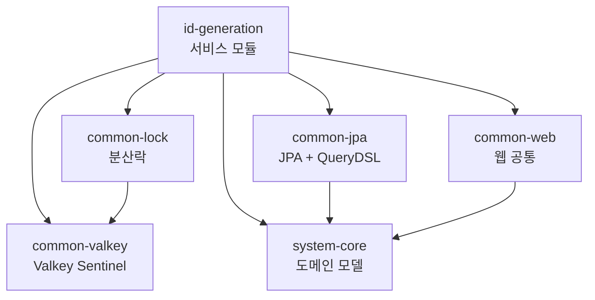
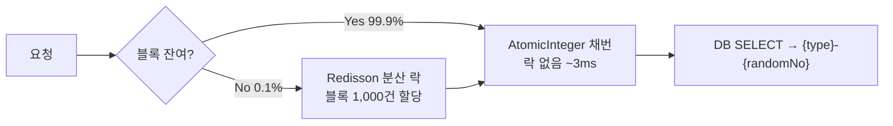

# ID Generator

Kotlin 기반 Random ID Generator + Redisson 분산락 프로젝트.
Segment 블록 할당 방식으로 고성능 분산 ID 채번을 제공한다.

## Tech Stack

| 항목 | 기술 |
|------|------|
| Language | Kotlin 2.1.21 |
| JDK | Java 21 |
| Framework | Spring Boot 3.5.4 |
| Database | PostgreSQL 16, Spring Data JPA, QueryDSL 7 |
| Cache | Valkey 7 (Sentinel), Redisson 3.52 |
| Migration | Flyway 11.4 |
| Testing | Kotest 5.8 (BehaviorSpec), Mockk 1.14 |
| Build | Gradle 8.14 (Kotlin DSL), Version Catalog |
| Infra | Kubernetes, Helm, Docker, Harbor |
| Load Test | Grafana k6 |

## Architecture

헥사고날 아키텍처 (Ports & Adapters) + 멀티모듈 Gradle 구조.



### 모듈 구조

```
id-generator/
├── build-logic/          # Gradle 컨벤션 플러그인
├── system-core/          # 순수 도메인 (Spring 의존 X)
├── core/
│   ├── common-jpa/       # JPA + QueryDSL (JPAQueryFactory)
│   ├── common-valkey/    # Redisson Sentinel 설정
│   ├── common-lock/      # 분산락 (AOP + DistributedLockManager)
│   └── common-web/       # 웹 공통 (GlobalExceptionHandler)
├── id-generation/        # 서비스 모듈 (헥사고날)
├── infrastructure/       # K8s 매니페스트 + Helm Chart
│   ├── app/              # Helm Chart (id-generator)
│   ├── valkey/           # Valkey Sentinel YAML
│   ├── k6/               # k6 부하테스트 스크립트
│   └── scripts/          # 빌드/배포/정리 스크립트
├── docs/                 # 가이드 문서 + 테스트 리포트
├── docker-compose.yml    # 로컬 인프라
└── gradle/libs.versions.toml
```

### 헥사고날 레이어 (id-generation)

```
adapter/in/rest/          → Controller (InPort 호출)
adapter/out/persistence/  → JPA + QueryDSL Adapter (OutPort 구현)
adapter/out/cache/        → Valkey Adapter (OutPort 구현, 장애 시 DB fallback)
application/port/in/      → InPort (UseCase 인터페이스)
application/port/out/     → OutPort (저장소 인터페이스)
application/service/      → UseCase + SegmentIdAllocator
application/exception/    → 비즈니스 예외 (503 LockAcquisitionFailed 포함)
domain/model/             → 도메인 모델 (UsedIdTypeInfo, LCG 알고리즘)
```

## ID 생성 알고리즘

선형 합동 생성기(LCG)를 사용하여 100,000개 범위 내에서 중복 없이 랜덤 순서로 ID를 생성한다.

```
nextSeq = (capacity + (currentSeq - 1 + coprimeIncrement)) % capacity + 1
```

- **Base33 인코딩**: I, O, S, L을 제외한 33개 문자로 4자리 ID 생성
- **서로소 증분**: capacity와 서로소인 증분값으로 전체 범위 순회 보장
- **Segment 블록 할당**: Pod별 1,000건 ID 블록을 사전 확보, 블록 내 AtomicInteger 채번

### 분산 락 전략



## API Endpoints

| Method | Path | 설명 |
|--------|------|------|
| `POST` | `/api/v1/id-generation/batch` | Base33 랜덤 ID 100,000건 배치 삽입 |
| `POST` | `/api/v1/id-generation/types/{type}` | 새 ID 타입 등록 |
| `POST` | `/api/v1/id-generation/{type}` | ID 생성 (e.g. `BACKUP-A1B2`) |

## Getting Started

### 1. 로컬 인프라 실행

```bash
docker compose up -d
```

- PostgreSQL: `localhost:5432` (idgen / testuser / testpass)
- Valkey Sentinel: `localhost:26379,26380,26381` (password: testpass)

### 2. 빌드 & 실행

```bash
# 빌드
./gradlew clean build

# 실행
./gradlew :id-generation:bootRun

# 테스트
./gradlew test
```

### 3. ID 생성 테스트

```bash
# 1) 배치 ID 삽입
curl -X POST http://localhost:8080/api/v1/id-generation/batch

# 2) 타입 등록
curl -X POST http://localhost:8080/api/v1/id-generation/types/AG

# 3) ID 생성
curl -X POST http://localhost:8080/api/v1/id-generation/AG
# → "AG-A1B2"
```

## Alpha 배포

```bash
# 전체 빌드 + Harbor 푸시
./infrastructure/scripts/build-push.sh

# K8s 배포 (Namespace + Valkey + App)
./infrastructure/scripts/deploy.sh

# App만 배포
./infrastructure/scripts/deploy.sh --app-only

# 정리
./infrastructure/scripts/teardown.sh          # App만
./infrastructure/scripts/teardown.sh --all    # 전체
```

## 성능

k6 부하테스트 결과 (50 VUs, 5분, In-Cluster):

| 지표 | Segment 적용 전 | Segment 적용 후 |
|------|----------------|----------------|
| 실패율 | 91.33% | **0.00%** |
| p(95) | 5,000ms | **7.22ms** |
| 처리량 | 8.89 req/s | **238.23 req/s** |
| Failover 중 실패율 | - | **0.02%** |

## 문서

| 문서 | 경로 |
|------|------|
| k6 부하테스트 가이드 | `docs/k6-load-testing-guide.md` |
| Valkey Sentinel 운영 가이드 | `docs/valkey-sentinel-guide.md` |
| 부하테스트 리포트 | `docs/load-test-report/` |
