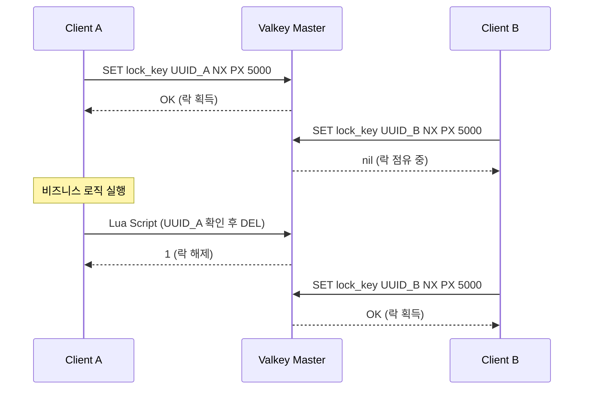
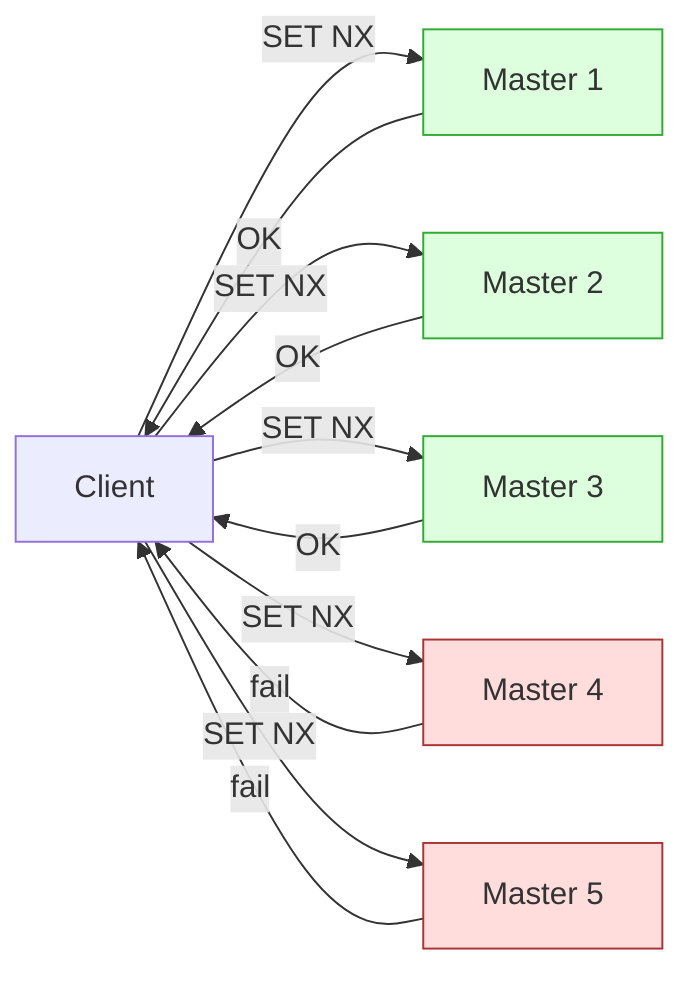
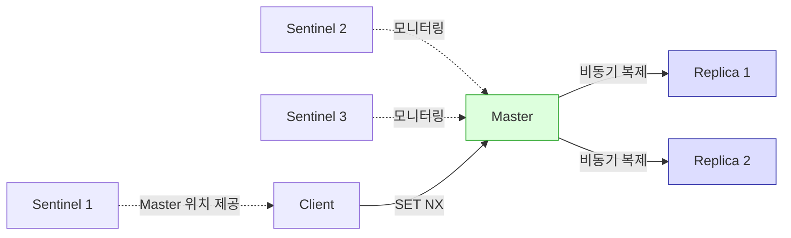
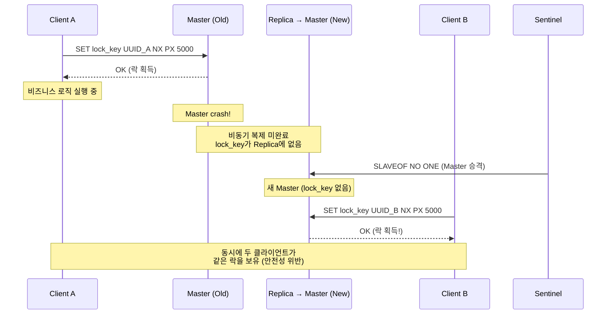
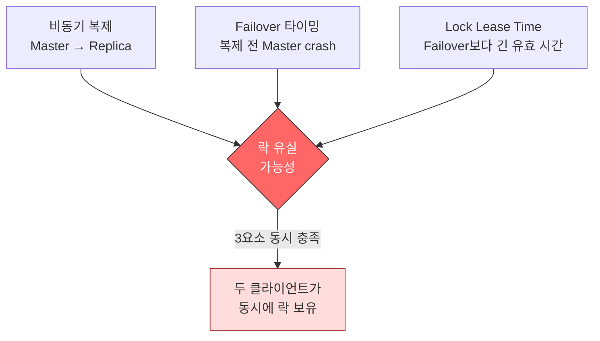
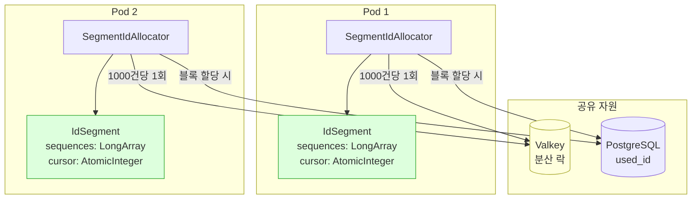
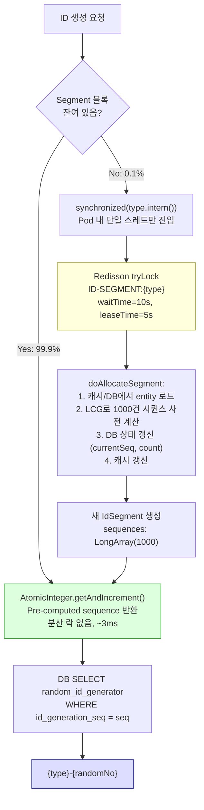
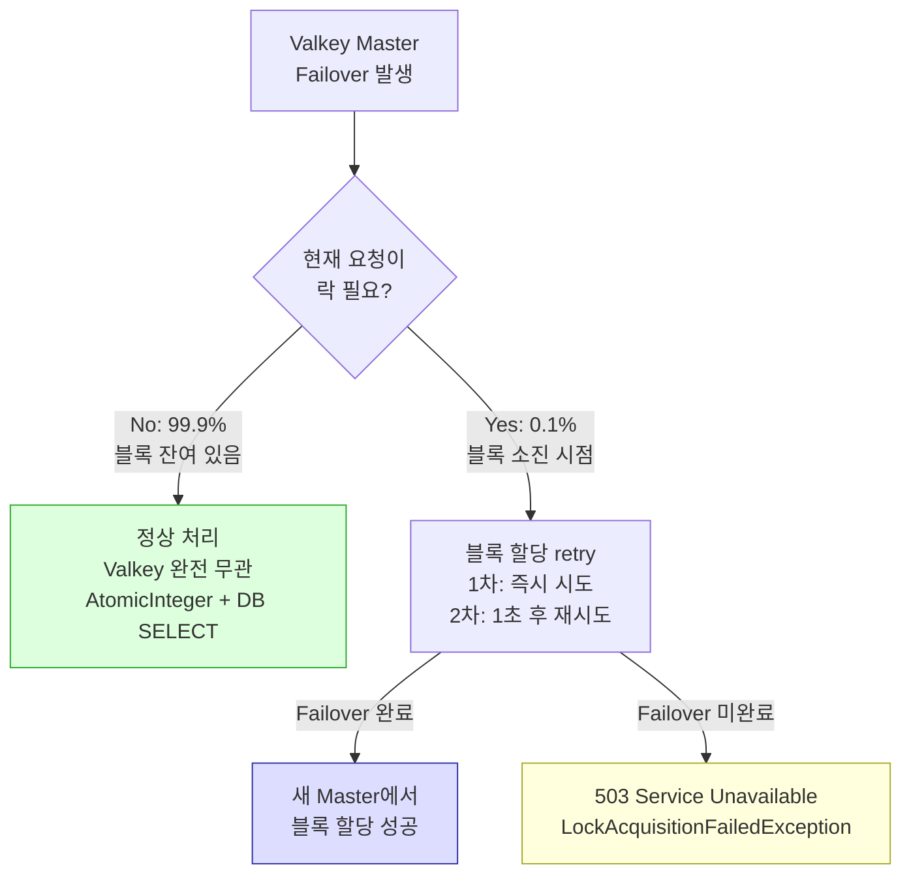
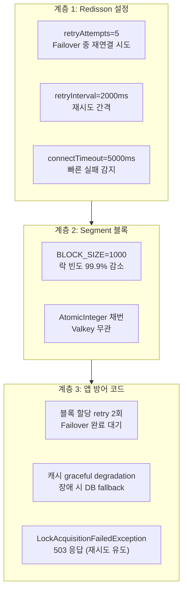
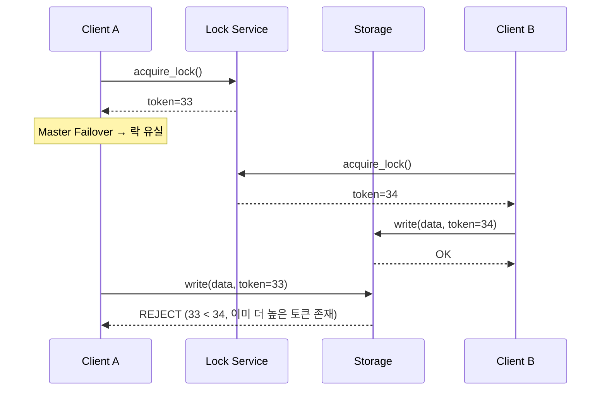

# 분산 락과 Failover 안전성 분석

## 목적 (Goal)

Valkey Sentinel 환경에서 Redisson 분산 락의 Failover 취약점을 분석하고,
Segment 블록 할당 패턴을 통한 대응 전략의 설계 근거와 실측 결과를 기록한다.

---

## 분산 락의 기본 원리

### Redis/Valkey 분산 락 동작



**핵심 보장:**
- `NX` (Not eXists): 키가 없을 때만 SET → 상호 배제 보장
- `PX` (만료 시간): 클라이언트 비정상 종료 시 데드락 방지
- `UUID`: 본인이 잡은 락만 해제 가능 → 타인의 락 해제 방지

---

## RedLock vs Sentinel 기반 락

### RedLock 알고리즘

Martin Kleppmann과 Salvatore Sanfilippo(Redis 창시자)의 논쟁으로 유명한 알고리즘.
**N개의 독립 Master**에서 과반수 합의로 락을 획득한다.



**RedLock 과반수 합의 프로세스:**

1. 현재 시간 기록 (T1)
2. N개 Master에 순차적으로 SET NX PX 요청
3. 과반수(N/2+1) 이상에서 성공 && 소요시간 < TTL일 때 락 획득
4. 유효 락 시간 = TTL - 소요시간(T2-T1)
5. 과반수 미달 시 모든 Master에서 DEL → 락 해제

### Sentinel 기반 락

**단일 Master에서 SET NX를 수행.** Sentinel은 Master 발견과 Failover만 담당하며,
**락 합의에는 관여하지 않는다.**



### 비교

| 기준 | RedLock | Sentinel 기반 |
|------|---------|---------------|
| 락 대상 | N개 독립 Master | 단일 Master |
| 합의 방식 | 클라이언트가 과반수 합의 | 없음 (단일 Master SET) |
| Failover 안전성 | Master 독립이라 영향 없음 | **비동기 복제로 락 유실 가능** |
| 인프라 비용 | Master 5개 (최소 3개) | Master 1 + Replica 2 + Sentinel 3 |
| 운영 복잡도 | 높음 (독립 인스턴스 관리) | 낮음 |
| 성능 | 느림 (N개 왕복) | 빠름 (1회 왕복) |
| 시계 의존성 | 높음 (TTL 정확성 필요) | 낮음 |

---

## Sentinel 기반 락의 Failover 취약점

### 문제 시나리오: 비동기 복제 + Failover = 락 유실



### 취약 조건 3요소



| 요소 | 설명 | 발생 확률 |
|------|------|-----------|
| **비동기 복제** | Master → Replica 복제에 ms~s 지연 | 항상 존재 |
| **Failover 타이밍** | 복제 전 Master crash | 낮음 (ms 단위 윈도우) |
| **Lease Time** | Failover 후에도 Client A가 락 유효하다고 판단 | 설정 의존 |

### 실제 영향 범위

| 상황 | 영향 |
|------|------|
| SET NX 직후 Master crash | 락 유실 → 중복 획득 가능 |
| SET NX 후 충분한 시간 경과 | 복제 완료 → 새 Master에도 락 존재 |
| Lease Time 만료 후 Failover | 이미 해제된 락 → 영향 없음 |

> **결론: 취약 윈도우는 "SET NX 직후 ~ 복제 완료 전"의 ms~수백ms 구간.**
> 이 짧은 구간에 Master crash가 발생해야 하므로, 실제 발생 확률은 매우 낮다.

---

## Segment 블록 할당 패턴

### 설계 동기

분산 락의 Failover 취약점을 **완전히 제거하는 것은 불가능**하다.
대신, **락 사용 빈도를 극단적으로 줄여** 취약 윈도우에 노출될 확률을 최소화한다.

### 핵심 아이디어

```
기존: 매 요청 1건 = 분산 락 1회 (락:요청 = 1:1)
개선: 1,000건당 분산 락 1회 (락:요청 = 1:1000)
```

### 아키텍처



### 동작 흐름



### IdSegment 구조

```kotlin
class IdSegment(
    private val sequences: LongArray,  // 사전 계산된 1000개 시퀀스
) {
    private val cursor = AtomicInteger(0)  // CAS 기반 원자적 증가

    fun next(): Long? {
        val index = cursor.getAndIncrement()
        return if (index < sequences.size) sequences[index] else null
    }
}
```

**Thread Safety:**
- `AtomicInteger.getAndIncrement()`: CAS(Compare-And-Swap) 기반, 락 없이 원자적
- 50 VUs 동시 접근에서도 경합 없이 ~3ms 응답

### Failover 내성 분석



| 시나리오 | 기존 (매 요청 락) | Segment 적용 후 |
|----------|-------------------|-----------------|
| Failover 중 영향 요청 비율 | **100%** (모든 요청이 락 필요) | **0.1%** (블록 소진 시점만) |
| 락 유실 시 영향 | 즉시 500 에러 | 블록 잔여분으로 서비스 지속 |
| 취약 윈도우 노출 빈도 | 요청 수 = 락 수 | 요청 수 / 1000 = 락 수 |

---

## 방어 코드 설계

### 계층별 방어



### 캐시 Graceful Degradation

```kotlin
// Valkey 장애 시에도 서비스 지속
override fun getOrLoad(type: String, loader: () -> UsedIdJpaEntity): UsedIdJpaEntity {
    val cached = try {
        redisTemplate.opsForValue().get(KEY_PREFIX + type)
    } catch (e: Exception) {
        log.warn(e) { "캐시 조회 실패, DB fallback" }
        null  // 장애 시 DB로 fallback
    }
    // ...
}

override fun put(type: String, entity: UsedIdJpaEntity): UsedIdJpaEntity {
    try {
        redisTemplate.opsForValue().set(...)
    } catch (e: Exception) {
        log.warn(e) { "캐시 저장 실패 (무시)" }  // 장애 시 무시
    }
    return entity
}
```

**설계 원칙: 캐시는 성능 최적화 수단이지 필수 의존이 아니다.**

---

## 실측 결과

### 성능 (50 VUs, 5분, In-Cluster)

| 지표 | 매 요청 락 (Phase 0) | Segment (Phase 2) | 개선율 |
|------|---------------------|-------------------|--------|
| 실패율 | 91.33% | **0.00%** | 해소 |
| p(95) | 5,000ms | **7.22ms** | **692배** |
| 처리량 | 8.89 req/s | **238.23 req/s** | **27배** |

### Failover 내성 (50 VUs 부하 중 Master 삭제)

| 지표 | 방어 코드 적용 전 | 방어 코드 적용 후 |
|------|-------------------|-------------------|
| 총 요청 수 | 82,481 | 79,289 |
| 실패 | 21건 (0.02%) | **0건 (0.00%)** |
| 처리량 | 274.92 req/s | 264.29 req/s |

---

## 대안 비교

### 언제 어떤 전략을 선택하나?

| 전략 | 적합한 상황 | 부적합한 상황 |
|------|-----------|-------------|
| **Sentinel + Segment (본 프로젝트)** | ID 채번처럼 블록 사전 할당이 가능한 경우 | 매 요청이 고유한 락 키를 사용하는 경우 |
| **RedLock** | 금융 거래 등 락 유실이 절대 불가한 경우 | 성능이 중요하고 인프라 비용이 제한적인 경우 |
| **DB 비관적 락** | 단순 구조, Valkey 없이 처리하고 싶은 경우 | 높은 동시성 + 빠른 응답이 필요한 경우 |
| **Fencing Token** | 락 유실 후에도 데이터 무결성을 검증해야 하는 경우 | 쓰기 대상이 fencing을 지원하지 않는 경우 |

### Fencing Token 패턴 (참고)

Martin Kleppmann이 제안한 락 안전성 보완 패턴.
락 획득 시 단조 증가하는 토큰을 발급하고, 쓰기 대상이 토큰 순서를 검증한다.



> 본 프로젝트에서는 Segment 블록이 사실상 Fencing Token 역할을 수행한다.
> 블록 할당 시 DB의 `currentSeq`/`count`가 단조 증가하며,
> 이전 블록의 시퀀스는 새 블록과 겹치지 않으므로 데이터 무결성이 보장된다.

---

## 결론

### Sentinel 기반 분산 락의 한계와 대응

1. **한계**: 비동기 복제 + Failover 조합에서 이론적 락 유실 가능 (ms 단위 취약 윈도우)
2. **실무적 판단**: 발생 확률이 극히 낮고, ID 채번의 경우 블록 기반 설계로 영향을 무력화 가능
3. **Segment 패턴의 효과**: 락 사용 빈도를 1/1000로 줄여 취약 윈도우 노출 자체를 최소화
4. **방어 코드의 역할**: Failover 구간에서도 retry + graceful degradation으로 서비스 지속

### 설계 원칙

```
"락의 안전성을 높이는 것보다, 락이 필요한 순간을 줄이는 것이 더 효과적이다."
```

- RedLock으로 완벽한 락을 만드는 대신, **Segment로 락 의존을 최소화**
- 캐시 장애 시 **DB fallback으로 서비스 지속** (캐시는 성능 수단, 필수 의존 아님)
- 남은 극소수 락 실패는 **retry + 503으로 클라이언트 재시도 유도**

---

## 참고 자료

- [Martin Kleppmann — How to do distributed locking (2016)](https://martin.kleppmann.com/2016/02/08/how-to-do-distributed-locking.html)
- [Salvatore Sanfilippo — Is Redlock safe? (2016)](http://antirez.com/news/101)
- [Redis Distributed Locks (RedLock)](https://redis.io/docs/manual/patterns/distributed-locks/)
- [Redisson Lock Documentation](https://github.com/redisson/redisson/wiki/8.-Distributed-locks-and-synchronizers)
