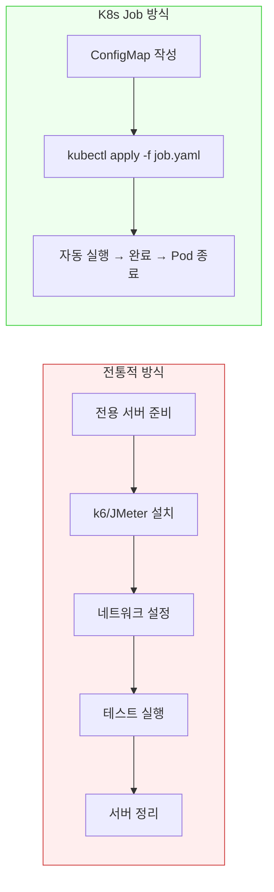
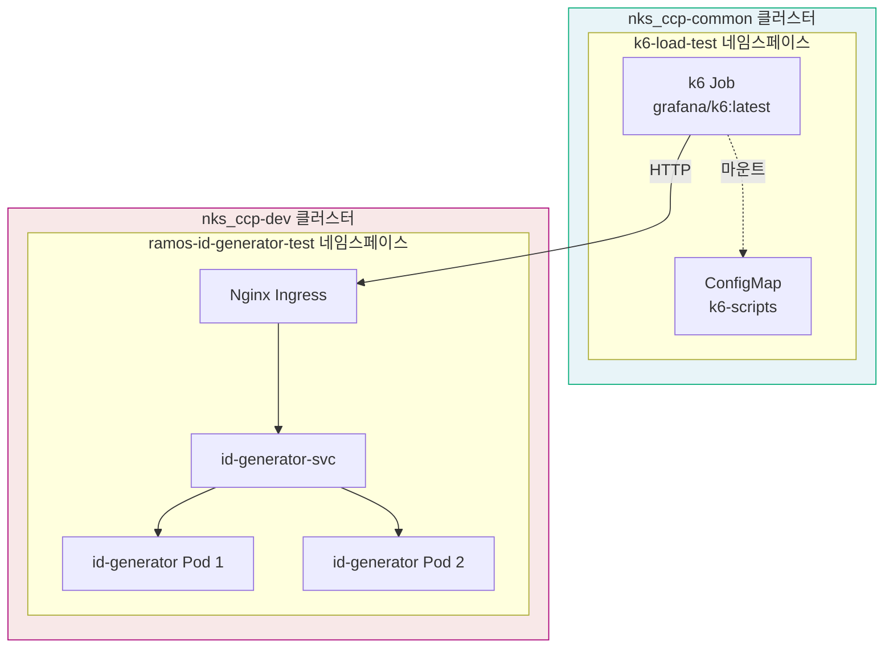
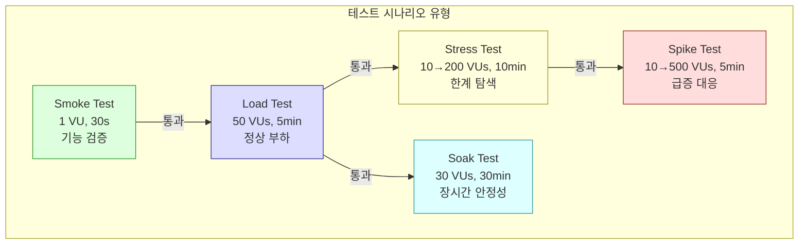
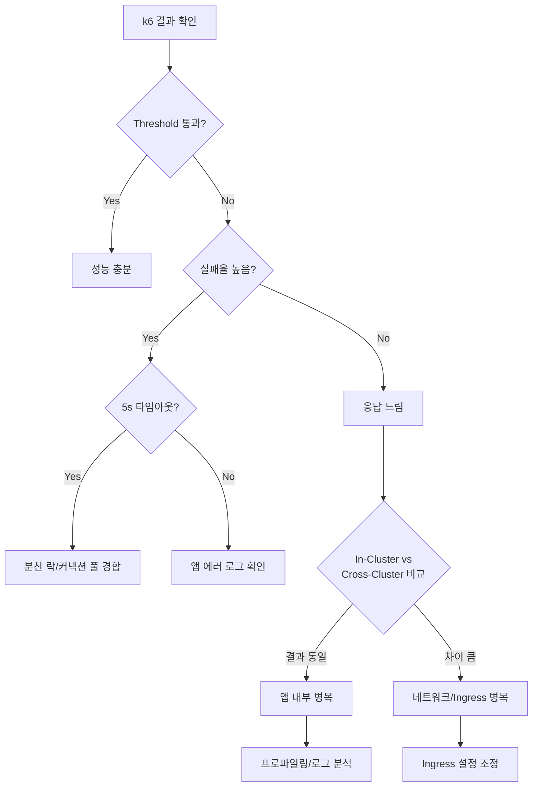

# k6 부하테스트 가이드 — Kubernetes 환경

## 목적 (Goal)

Kubernetes 환경에서 k6를 활용한 부하테스트 환경 구축 방법과 운영 가이드를 제공한다.
id-generator 프로젝트의 Alpha 환경을 실전 예시로 활용하며,
K8s Job 기반 테스트의 용이성과 장점을 설명한다.

## 배경 (Context)

부하테스트는 성능 병목을 사전에 발견하고, 시스템의 한계를 파악하여
안정적인 서비스 운영을 가능하게 하는 핵심 활동이다.

전통적으로 부하테스트는 별도 서버에서 JMeter, Gatling 등의 도구를 설치하여 수행했지만,
**Kubernetes 환경에서는 k6 + Job 조합으로 훨씬 간편하게 구축할 수 있다.**

---

## k6를 선택한 이유

| 기준 | k6 | JMeter | Gatling |
|------|-----|--------|---------|
| 스크립트 언어 | JavaScript (ES6) | XML/GUI | Scala |
| K8s 친화성 | Container 이미지 제공 | JVM 설치 필요 | JVM 설치 필요 |
| 리소스 효율 | Go 바이너리, 경량 | JVM 기반, 무거움 | JVM 기반, 무거움 |
| CI/CD 통합 | CLI 기반, threshold 자동 판정 | GUI 중심 | SBT 빌드 필요 |
| 학습 곡선 | 낮음 (JS 기반) | 중간 (GUI) | 높음 (Scala DSL) |

---

## K8s 환경에서의 부하테스트 구축 용이성

### 전통적 방식 vs K8s Job 방식



### K8s Job 기반 부하테스트의 장점

1. **인프라 준비 불필요**
   - 전용 서버 프로비저닝/관리 없음
   - `grafana/k6` 이미지를 그대로 사용
   - K8s 클러스터만 있으면 즉시 시작 가능

2. **재현 가능한 테스트 환경**
   - ConfigMap에 스크립트를 선언적으로 관리
   - Job YAML로 동일 조건 반복 실행 보장
   - Git에 스크립트를 함께 관리하여 코드 리뷰 가능

3. **네트워크 위치 선택의 자유**
   - **동일 클러스터**: ClusterIP로 직접 호출 → 순수 앱 성능 측정
   - **다른 클러스터**: 외부 도메인 경유 → E2E 네트워크 포함 측정
   - 목적에 따라 테스트 위치를 유연하게 변경 가능

4. **리소스 자동 관리**
   - Job 완료 시 Pod 자동 종료
   - `ttlSecondsAfterFinished`로 자동 정리 가능
   - 테스트 도구가 클러스터 리소스를 장기 점유하지 않음

5. **스케일 아웃 용이**
   - 여러 Job을 동시 실행하여 분산 부하 생성
   - 단일 k6 인스턴스의 한계를 넘는 대규모 테스트 가능

---

## 아키텍처

### 전체 구조



### 네트워크 경로 비교

| 방식 | 경로 | 용도 |
|------|------|------|
| Cross-Cluster | k6 Pod → DNS → Ingress → Service → Pod | E2E 성능, 실제 사용자 시뮬레이션 |
| In-Cluster | k6 Pod → Service (ClusterIP) → Pod | 순수 앱 성능, 네트워크 병목 제거 |

---

## 구축 가이드

### Step 1: 네임스페이스 생성

```bash
kubectl --context <cluster> create namespace k6-load-test
```

### Step 2: k6 스크립트 작성 (ConfigMap)

```yaml
apiVersion: v1
kind: ConfigMap
metadata:
  name: k6-scripts
  namespace: k6-load-test
data:
  smoke.js: |
    import http from 'k6/http';
    import { check, sleep } from 'k6';

    // 환경변수로 BASE_URL 주입 가능 — 유연한 대상 지정
    const BASE_URL = __ENV.BASE_URL || 'http://target-service.default.svc.cluster.local';

    export const options = {
      vus: 1,
      duration: '30s',
      thresholds: {
        http_req_failed: ['rate<0.01'],       // 실패율 1% 미만
        http_req_duration: ['p(95)<500'],      // p95 500ms 미만
      },
    };

    export default function () {
      const res = http.get(`${BASE_URL}/actuator/health`);
      check(res, {
        'status 200': (r) => r.status === 200,
      });
      sleep(1);
    }
```

**포인트:**
- `__ENV.BASE_URL`로 대상 URL을 외부 주입 가능
- `thresholds`로 자동 PASS/FAIL 판정 → CI/CD 연동에 활용
- `check`로 응답 내용 검증

### Step 3: Job YAML 작성

```yaml
apiVersion: batch/v1
kind: Job
metadata:
  name: k6-smoke
  namespace: k6-load-test
spec:
  backoffLimit: 0          # 실패 시 재시도 안 함
  ttlSecondsAfterFinished: 3600  # 1시간 후 자동 정리
  template:
    spec:
      restartPolicy: Never
      containers:
        - name: k6
          image: grafana/k6:latest
          command: ["k6", "run", "/scripts/smoke.js"]
          # 환경변수로 BASE_URL 오버라이드 가능
          # env:
          #   - name: BASE_URL
          #     value: "http://custom-target:8080"
          volumeMounts:
            - name: scripts
              mountPath: /scripts
              readOnly: true
          resources:
            requests:
              cpu: 250m
              memory: 128Mi
            limits:
              cpu: 500m
              memory: 256Mi
      volumes:
        - name: scripts
          configMap:
            name: k6-scripts
```

**리소스 가이드:**

| 시나리오 | VUs | CPU request | Memory request |
|----------|-----|-------------|----------------|
| Smoke (1~5 VUs) | 1~5 | 250m | 128Mi |
| Load (50 VUs) | 50 | 500m | 256Mi |
| Stress (200 VUs) | 200 | 1000m | 512Mi |
| Spike (500 VUs) | 500 | 2000m | 1Gi |

### Step 4: 실행 및 결과 확인

```bash
# 1. 배포
kubectl apply -f configmap.yaml
kubectl apply -f job-smoke.yaml

# 2. 완료 대기
kubectl wait --for=condition=complete job/k6-smoke -n k6-load-test --timeout=120s

# 3. 결과 확인
kubectl logs job/k6-smoke -n k6-load-test

# 4. 정리
kubectl delete job k6-smoke -n k6-load-test
```

---

## 테스트 시나리오 유형



| 시나리오 | 목적 | 실행 시점 |
|----------|------|-----------|
| **Smoke** | 기본 연결/기능 검증 | 배포 직후, CI/CD |
| **Load** | 예상 트래픽에서의 성능 측정 | 주기적, 성능 변경 시 |
| **Stress** | 시스템 한계점 탐색 | 릴리스 전, 아키텍처 변경 시 |
| **Spike** | 급격한 트래픽 증가 대응력 | HPA/오토스케일링 검증 시 |
| **Soak** | 메모리 누수, 커넥션 풀 고갈 등 장기 안정성 | 릴리스 전 |

---

## Threshold 설계 가이드

k6의 `thresholds`는 테스트 자동 판정의 핵심이다.

```javascript
export const options = {
  thresholds: {
    // 실패율
    http_req_failed: ['rate<0.01'],          // 99% 이상 성공

    // 응답시간
    http_req_duration: [
      'p(50)<200',    // 중앙값 200ms 이내
      'p(90)<500',    // 90% 500ms 이내
      'p(95)<1000',   // 95% 1초 이내
      'p(99)<3000',   // 99% 3초 이내
    ],

    // 커스텀 메트릭 (Trend)
    'http_req_duration{expected_response:true}': ['p(95)<500'],
  },
};
```

**환경별 threshold 조정:**

| 환경 | p(95) 기준 | 실패율 기준 | 비고 |
|------|-----------|------------|------|
| In-Cluster (ClusterIP) | 500ms | 1% | 순수 앱 성능 |
| Cross-Cluster (Ingress) | 3,000ms | 5% | 네트워크 레이턴시 포함 |
| 외부 (Public DNS) | 5,000ms | 5% | CDN/LB 포함 |

---

## Cross-Cluster vs In-Cluster 테스트

### 언제 어떤 방식을 사용하나?

| 목적 | 추천 방식 | 이유 |
|------|-----------|------|
| 앱 코드 성능 측정 | In-Cluster | 네트워크 변수 제거 |
| Ingress 설정 검증 | Cross-Cluster | 실제 경로 포함 |
| HPA 스케일아웃 테스트 | In-Cluster | 안정적인 부하 전달 |
| 실제 사용자 시뮬레이션 | Cross-Cluster | E2E 경로 재현 |
| 성능 회귀 테스트 (CI) | In-Cluster | 재현 가능한 결과 |

### id-generator 프로젝트 실전 사례

본 프로젝트에서는 두 가지 방식을 모두 수행하여 병목 지점을 정확히 식별했다.

| 방식 | 결과 | 발견 |
|------|------|------|
| Cross-Cluster (nks_ccp-common → nks_ccp-dev) | 91.68% 실패 | 초기에 네트워크 병목으로 오인 |
| In-Cluster (nks_ccp-dev 내부) | 91.33% 실패 | **결과 동일 → 앱 내부 병목 확정** |

> 두 가지 방식을 비교함으로써 "네트워크 vs 앱" 병목을 명확히 구분할 수 있었다.
> 한 가지 방식만 수행했다면 잘못된 원인 분석으로 이어질 수 있었다.

---

## 결과 분석 방법

### k6 출력 읽는 법

```
  █ THRESHOLDS

    http_req_duration
    ✓ 'p(95)<500' p(95)=320ms       ← PASS
    ✗ 'p(99)<1000' p(99)=1.2s      ← FAIL

    http_req_failed
    ✓ 'rate<0.01' rate=0.00%       ← PASS

  █ TOTAL RESULTS

    checks_succeeded...: 100.00%    ← 모든 체크 통과
    http_req_duration..: avg=150ms  p(90)=280ms  p(95)=320ms
    http_reqs..........: 5000       50/s         ← 총 요청수, 처리량
```

### 핵심 분석 포인트

1. **Threshold 통과 여부** — 자동 PASS/FAIL
2. **p(95) vs avg** — 격차가 크면 일부 요청에 스파이크 존재
3. **http_req_failed rate** — 0이 아니면 원인 파악 필요
4. **iterations vs http_reqs** — 차이가 크면 연결 실패 의미
5. **data_received/sent** — 네트워크 throughput

### 결과 기반 의사결정 플로우



---

## CI/CD 통합

k6의 threshold 기반 자동 판정을 CI/CD에 활용할 수 있다.

```yaml
# Tekton Task 예시
apiVersion: tekton.dev/v1beta1
kind: Task
metadata:
  name: k6-performance-gate
spec:
  steps:
    - name: run-k6
      image: grafana/k6:latest
      script: |
        k6 run /scripts/smoke.js
        # threshold 실패 시 exit code 99 반환 → 파이프라인 중단
```

k6 exit code:
- `0`: 모든 threshold 통과
- `99`: threshold 위반 (성능 기준 미달)
- `1`: 스크립트 에러

---

## 정리 (Cleanup)

```bash
# 특정 Job 삭제
kubectl delete job k6-smoke -n k6-load-test

# 전체 k6 Job 정리
kubectl delete jobs -n k6-load-test -l app.kubernetes.io/part-of=k6-load-test

# 네임스페이스 전체 삭제
kubectl delete namespace k6-load-test
```

---

## 참고 자료

- [k6 공식 문서](https://grafana.com/docs/k6/latest/)
- [k6 Docker 이미지](https://hub.docker.com/r/grafana/k6)
- [k6 Threshold 가이드](https://grafana.com/docs/k6/latest/using-k6/thresholds/)
- id-generator 프로젝트 테스트 리포트: `docs/load-test-report/`
- id-generator 프로젝트 k6 스크립트: `infrastructure/k6/`
