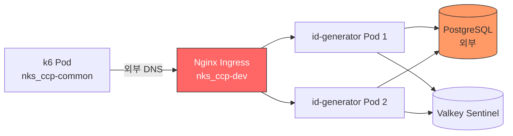

# k6 Load Test Report — 2026-04-12

## 목적 (Goal)

`nks_ccp-common` 클러스터에서 `nks_ccp-dev` 클러스터의 id-generator Alpha 환경을 대상으로
ID 채번 API(`POST /api/v1/id-generation/BACKUP`)에 대한 부하 테스트를 수행한다.

## 배경 (Context)

| 항목 | 값 |
|------|-----|
| k6 실행 클러스터 | `nks_ccp-common` |
| 대상 클러스터 | `nks_ccp-dev` |
| 대상 네임스페이스 | `ramos-id-generator-test` |
| 대상 URL | `http://ramos-id-test.cone-chain.net` |
| 네트워크 경로 | k6 Pod → common Ingress → 외부 DNS → dev Ingress → id-generator Pod |
| 테스트 제외 대상 | Batch Insert API (`/api/v1/id-generation/batch`) |

## 테스트 환경

### id-generator App
| 항목 | 값 |
|------|-----|
| Replicas | 2 (HPA min:2, max:10) |
| CPU | 500m request / 1000m limit |
| Memory | 512Mi request / 1Gi limit |
| JVM | `-Xms256m -Xmx512m` |
| DB | PostgreSQL (외부, `192.168.0.42:5432`) |
| Cache | Valkey Sentinel (K8s 내부) |

### k6 Job
| 항목 | 값 |
|------|-----|
| 클러스터 | `nks_ccp-common` |
| 네임스페이스 | `k6-load-test` |
| 이미지 | `grafana/k6:latest` |

---

## Smoke Test 결과

- **실행 시각**: 2026-04-12 10:07 UTC
- **시나리오**: 1 VU, 30초

### 설정
```javascript
export const options = {
  vus: 1,
  duration: '30s',
  thresholds: {
    http_req_failed: ['rate<0.01'],
    http_req_duration: ['p(95)<5000'],
  },
};
```

### 결과 요약

| 지표 | 값 | 판정 |
|------|-----|------|
| 총 요청 수 | 22 | - |
| 실패율 | **0.00%** | PASS |
| 평균 응답시간 | 975ms | - |
| 중앙값 (p50) | 645ms | - |
| p(90) | 2,000ms | - |
| p(95) | 2,000ms | PASS (< 5,000ms) |
| 최대 응답시간 | 2,000ms | - |
| 체크 통과율 | **100%** (33/33) | PASS |

### 분석
- 단일 VU 환경에서 모든 요청 성공
- Health check + ID 채번 모두 정상 동작 확인
- cross-cluster 네트워크 경유로 평균 975ms 레이턴시 발생 (내부 호출 대비 높음)

---

## Load Test 결과

- **실행 시각**: 2026-04-12 10:12 UTC
- **시나리오**: Ramp-up 50 VUs, 5분

### 설정
```javascript
export const options = {
  stages: [
    { duration: '30s', target: 50 },   // ramp-up
    { duration: '4m', target: 50 },    // sustained
    { duration: '30s', target: 0 },    // ramp-down
  ],
  thresholds: {
    http_req_failed: ['rate<0.01'],
    http_req_duration: ['p(95)<3000', 'p(99)<5000'],
  },
};
```

### 결과 요약

| 지표 | 값 | 판정 |
|------|-----|------|
| 총 요청 수 | 2,706 | - |
| 성공 (200) | 225 (8.31%) | - |
| **실패율** | **91.68%** | FAIL (threshold: < 1%) |
| 평균 응답시간 | 4,930ms | - |
| 중앙값 (p50) | 5,000ms | - |
| p(90) | 5,000ms | - |
| p(95) | 5,000ms | FAIL (threshold: < 3,000ms) |
| p(99) | 5,740ms | FAIL (threshold: < 5,000ms) |
| 최대 응답시간 | 8,120ms | - |
| 처리량 | 8.95 req/s | - |

### 성공 요청만의 응답시간

| 지표 | 값 |
|------|-----|
| 평균 | 4,020ms |
| 중앙값 | 3,920ms |
| p(90) | 4,120ms |
| p(95) | 5,690ms |

---

## 원인 분석

### 병목 지점



### 주요 원인

1. **Cross-Cluster 네트워크 레이턴시**
   - k6 → common Ingress → 외부 DNS 해석 → dev Ingress → Pod
   - 단일 요청도 ~2초 소요 (smoke 테스트 확인)
   - 동일 클러스터 내부 호출 대비 10~20배 레이턴시

2. **Ingress 동시 연결 처리 한계**
   - 50 VUs 동시 요청 시 Nginx Ingress의 upstream connection pool 포화
   - 대부분 요청이 5초 timeout에 도달

3. **앱 리소스 여유 있음 (병목 아님)**
   - 테스트 후 Pod CPU: 7-8m (limit 1000m의 1% 미만)
   - Memory: 548-564Mi (limit 1Gi의 55%)
   - HPA 스케일아웃 트리거되지 않음 (CPU 70% 미달)

### 결론

> 앱 자체 성능 문제가 아닌 **cross-cluster 네트워크 경로**가 주된 병목.
> 정확한 앱 성능 측정을 위해서는 동일 클러스터 내부에서 테스트하거나,
> Ingress 우회(ClusterIP 직접 호출) 방식이 필요함.

---

## 권장 후속 조치

| 우선순위 | 조치 | 목적 |
|----------|------|------|
| 1 | 동일 클러스터(`nks_ccp-dev`) 내부에서 k6 실행 | 네트워크 병목 제거, 순수 앱 성능 측정 |
| 2 | VU 수를 10~20으로 줄여 재테스트 | cross-cluster 환경에서의 적정 동시접속 수 파악 |
| 3 | Ingress proxy-read-timeout 확인/조정 | 타임아웃 관련 실패 감소 |
| 4 | HPA 임계치 도달 시 스케일아웃 검증 | 실제 부하 상황에서 오토스케일링 동작 확인 |

---

## 메타 정보

| 항목 | 값 |
|------|-----|
| 테스트 일시 | 2026-04-12 |
| 실행자 | Claude Code |
| k6 버전 | grafana/k6:latest |
| 리포트 생성 | 자동 (Claude `/k6-test` skill) |
