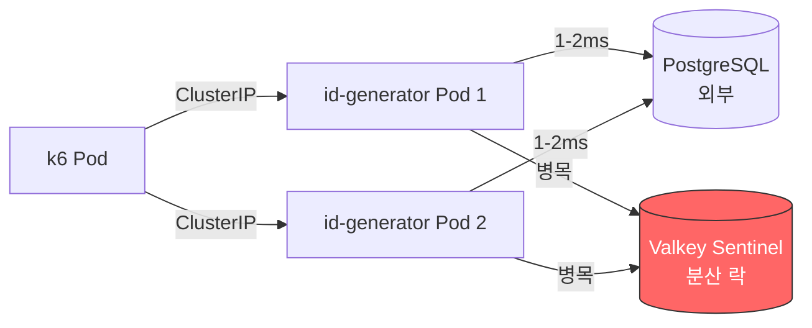

# k6 Load Test Report — 2026-04-12

## 목적 (Goal)

`nks_ccp-common` 클러스터에서 `nks_ccp-dev` 클러스터의 id-generator Alpha 환경을 대상으로
ID 채번 API(`POST /api/v1/id-generation/BACKUP`)에 대한 부하 테스트를 수행한다.

## 배경 (Context)

| 항목 | 값 |
|------|-----|
| k6 실행 클러스터 | `nks_ccp-common` |
| 대상 클러스터 | `nks_ccp-dev` |
| 대상 네임스페이스 | `ramos-id-generator-test` |
| 대상 URL | `http://ramos-id-test.cone-chain.net` |
| 네트워크 경로 | k6 Pod → common Ingress → 외부 DNS → dev Ingress → id-generator Pod |
| 테스트 제외 대상 | Batch Insert API (`/api/v1/id-generation/batch`) |

## 테스트 환경

### id-generator App
| 항목 | 값 |
|------|-----|
| Replicas | 2 (HPA min:2, max:10) |
| CPU | 500m request / 1000m limit |
| Memory | 512Mi request / 1Gi limit |
| JVM | `-Xms256m -Xmx512m` |
| DB | PostgreSQL (외부, `192.168.0.42:5432`) |
| Cache | Valkey Sentinel (K8s 내부) |

### k6 Job
| 항목 | 값 |
|------|-----|
| 클러스터 | `nks_ccp-common` |
| 네임스페이스 | `k6-load-test` |
| 이미지 | `grafana/k6:latest` |

---

## Smoke Test 결과

- **실행 시각**: 2026-04-12 10:07 UTC
- **시나리오**: 1 VU, 30초

### 설정
```javascript
export const options = {
  vus: 1,
  duration: '30s',
  thresholds: {
    http_req_failed: ['rate<0.01'],
    http_req_duration: ['p(95)<5000'],
  },
};
```

### 결과 요약

| 지표 | 값 | 판정 |
|------|-----|------|
| 총 요청 수 | 22 | - |
| 실패율 | **0.00%** | PASS |
| 평균 응답시간 | 975ms | - |
| 중앙값 (p50) | 645ms | - |
| p(90) | 2,000ms | - |
| p(95) | 2,000ms | PASS (< 5,000ms) |
| 최대 응답시간 | 2,000ms | - |
| 체크 통과율 | **100%** (33/33) | PASS |

### 분석
- 단일 VU 환경에서 모든 요청 성공
- Health check + ID 채번 모두 정상 동작 확인
- cross-cluster 네트워크 경유로 평균 975ms 레이턴시 발생 (내부 호출 대비 높음)

---

## Load Test 결과

- **실행 시각**: 2026-04-12 10:12 UTC
- **시나리오**: Ramp-up 50 VUs, 5분

### 설정
```javascript
export const options = {
  stages: [
    { duration: '30s', target: 50 },   // ramp-up
    { duration: '4m', target: 50 },    // sustained
    { duration: '30s', target: 0 },    // ramp-down
  ],
  thresholds: {
    http_req_failed: ['rate<0.01'],
    http_req_duration: ['p(95)<3000', 'p(99)<5000'],
  },
};
```

### 결과 요약

| 지표 | 값 | 판정 |
|------|-----|------|
| 총 요청 수 | 2,706 | - |
| 성공 (200) | 225 (8.31%) | - |
| **실패율** | **91.68%** | FAIL (threshold: < 1%) |
| 평균 응답시간 | 4,930ms | - |
| 중앙값 (p50) | 5,000ms | - |
| p(90) | 5,000ms | - |
| p(95) | 5,000ms | FAIL (threshold: < 3,000ms) |
| p(99) | 5,740ms | FAIL (threshold: < 5,000ms) |
| 최대 응답시간 | 8,120ms | - |
| 처리량 | 8.95 req/s | - |

### 성공 요청만의 응답시간

| 지표 | 값 |
|------|-----|
| 평균 | 4,020ms |
| 중앙값 | 3,920ms |
| p(90) | 4,120ms |
| p(95) | 5,690ms |

---

## Internal Load Test 결과 (동일 클러스터)

Cross-cluster 네트워크 병목 가설을 검증하기 위해, `nks_ccp-dev` 클러스터 내부에서
K8s Service DNS(`id-generator-svc.ramos-id-generator-test.svc.cluster.local`)로 직접 호출하여 재테스트를 수행했다.

### Internal Smoke Test

- **실행 시각**: 2026-04-12 10:27 UTC
- **시나리오**: 1 VU, 30초, ClusterIP 직접 호출

| 지표 | 값 | Cross-Cluster 비교 |
|------|-----|---------------------|
| 총 요청 수 | 20 | 22 |
| 실패율 | **0.00%** | 0.00% (동일) |
| 평균 응답시간 | 1,330ms | 975ms |
| p(95) | 4,020ms | 2,000ms |
| 최대 응답시간 | 6,920ms | 2,000ms |

### Internal Load Test (50 VUs, 5분)

- **실행 시각**: 2026-04-12 10:28 UTC
- **시나리오**: Ramp-up 50 VUs, 5분, ClusterIP 직접 호출

| 지표 | Internal (ClusterIP) | Cross-Cluster (Ingress) |
|------|---------------------|------------------------|
| 총 요청 수 | 2,700 | 2,706 |
| 성공 (200) | 234 (8.66%) | 225 (8.31%) |
| **실패율** | **91.33%** | **91.68%** |
| 평균 응답시간 | 4,940ms | 4,930ms |
| p(50) | 5,000ms | 5,000ms |
| p(95) | 5,000ms | 5,000ms |
| p(99) | 5,780ms | 5,740ms |
| 최대 응답시간 | 7,710ms | 8,120ms |
| 처리량 | 8.89 req/s | 8.95 req/s |

### Internal 성공 요청만의 응답시간

| 지표 | 값 |
|------|-----|
| 평균 | 4,150ms |
| 중앙값 | 3,920ms |
| p(90) | 4,960ms |
| p(95) | 5,930ms |

---

## 원인 분석

### 병목 지점



### 핵심 발견: 네트워크가 아닌 분산 락 경합

Cross-cluster와 Internal 테스트 결과가 **거의 동일**하므로, 네트워크는 병목이 아니다.

**앱 로그 분석 (p6spy)**:
```
# DB 쿼리: 0-2ms (매우 빠름)
took 1ms | update used_id set current_seq=40754, count=254 where type='BACKUP'
took 0ms | select from random_id_generator where id_generation_seq=40754
took 1ms | commit

# 전체 요청 시간: 1,502ms ~ 6,919ms (매우 느림)
http_request_end method=POST path=/api/v1/id-generation/BACKUP elapsedMs=1502
http_request_end method=POST path=/api/v1/id-generation/BACKUP elapsedMs=6919
```

**DB 쿼리 합계 ~3ms vs 전체 요청 1,500~6,900ms** → 차이는 **Redisson 분산 락 획득 대기 시간**.

### 주요 원인

1. **분산 락(Redisson) 경합 — 주 병목**
   - ID 채번은 `BACKUP` 타입에 대해 분산 락을 잡고 순차 처리
   - 50 VUs 동시 요청 시 락 대기 큐에 적체
   - 락 waitTime(추정 5초) 초과 시 실패 → 91% 실패율의 원인
   - 단일 VU에서도 락 획득에 수초 소요 (다른 Pod과의 경합)

2. **앱 리소스는 여유 있음 (병목 아님)**
   - 테스트 후 Pod CPU: 7m (limit 1000m의 0.7%)
   - Memory: 555-571Mi (limit 1Gi의 55%)
   - HPA 스케일아웃 미트리거 (CPU 70% 미달)
   - Pod 수를 늘려도 락 경합이 해소되지 않으므로 성능 개선 효과 제한적

3. **Cross-Cluster 네트워크는 병목이 아님**
   - Internal/External 테스트 결과 거의 동일
   - 초기 가설(네트워크 병목) 기각

### 결론

> **ID 채번 API의 성능 병목은 Redisson 분산 락 경합이다.**
> 단일 타입(`BACKUP`)에 대해 모든 요청이 직렬화되어, 동시 요청 수가 증가하면
> 락 대기 타임아웃으로 대부분 실패한다.
> Pod 스케일아웃으로는 해결되지 않으며, 근본적인 동시성 전략 개선이 필요하다.

---

## 권장 후속 조치

| 우선순위 | 조치 | 목적 |
|----------|------|------|
| 1 | **락 범위 축소** — 타입+시퀀스 단위로 세분화하여 동시 처리 가능하도록 개선 | 동시성 병목 해소 |
| 2 | **ID 풀 사전 할당** — 범위 기반 ID 블록을 미리 확보하여 매 요청마다 락 불필요하게 변경 | 락 빈도 감소 |
| 3 | **락 waitTime/leaseTime 튜닝** — 현재 설정 확인 후 최적값 조정 | 실패율 감소 |
| 4 | **다중 ID 타입으로 분산** — 타입별 독립 락이므로 타입을 늘려 경합 분산 | 수평 분산 |
| 5 | **VU 10~20으로 재테스트** — 현재 동시성 한계 내에서의 정상 성능 지표 확보 | 베이스라인 확립 |

---

## 메타 정보

| 항목 | 값 |
|------|-----|
| 테스트 일시 | 2026-04-12 |
| 실행자 | Claude Code |
| k6 버전 | grafana/k6:latest |
| 테스트 방식 | Cross-Cluster (nks_ccp-common → nks_ccp-dev) + Internal (nks_ccp-dev 내부) |
| 리포트 생성 | 자동 (Claude `/k6-test` skill) |
