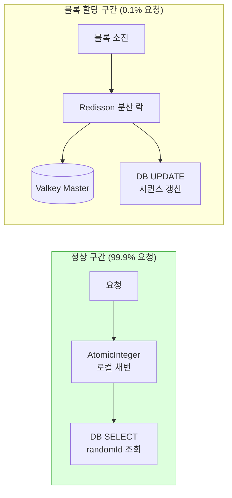
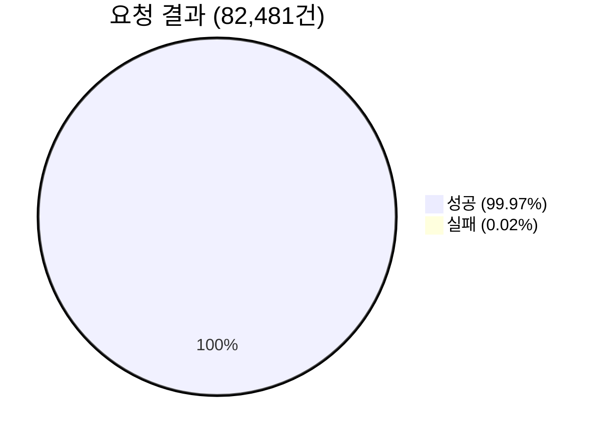
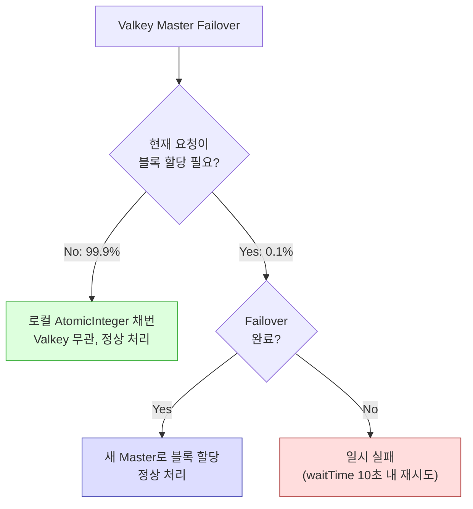

# Valkey Sentinel Failover 테스트 리포트 — 2026-04-12

## 목적 (Goal)

Valkey Sentinel Master 장애 발생 시, id-generator 앱의 Segment 기반 분산 락이
자동 Failover를 통해 정상적으로 서비스를 지속하는지 검증한다.

## 배경 (Context)

| 항목 | 값 |
|------|-----|
| 클러스터 | `nks_ccp-dev` |
| 네임스페이스 | `ramos-id-generator-test` |
| Valkey 구성 | Master ×1, Replica ×2, Sentinel ×3 |
| 앱 구성 | id-generator ×2 Pod (Segment 블록 할당 적용) |
| 분산 락 | Redisson Sentinel, `ID-SEGMENT:{type}` (블록 할당 시에만 사용) |
| Sentinel 설정 | down-after-milliseconds: 5000, failover-timeout: 10000, quorum: 2 |

### Segment 최적화와 Failover의 관계



> Segment 최적화 덕분에 **99.9%의 요청은 Valkey에 접근하지 않음**.
> Failover 영향은 블록 할당 시점(1,000건당 1회)에만 발생.

---

## 시나리오 1: Master Pod 삭제 (기본 Failover)

### 실행

| 시각 | 이벤트 |
|------|--------|
| 21:13:19 | `valkey-master-0` Pod 삭제 |
| 21:13:24 | Redisson WARN: slave down 감지 |
| 21:13:26 | Redisson: 새 연결 초기화 완료 (~2초) |
| 21:13:31 | ID 생성 테스트 5건 모두 성공 |

### 결과

| 항목 | 결과 |
|------|------|
| Failover 완료 시간 | ~7초 |
| 새 Master | `10.100.148.153:6379` (Replica 승격) |
| 앱 영향 | **없음** — Failover 중 5건 모두 200 OK, 53~78ms |
| Redisson 재연결 | ~2초 내 자동 완료 |

### 핵심 분석

**Failover 중에도 ID 생성이 정상인 이유:**
- Segment 블록에 잔여 ID가 있었으므로 분산 락(Valkey 접근) 불필요
- `AtomicInteger.getAndIncrement()` → DB SELECT만으로 처리
- **Valkey가 다운되어도 블록 내 채번은 영향 없음**

### 앱 로그

```
12:13:24 WARN  SentinelConnectionManager: slave 10.100.148.153 is down
12:13:25 WARN  SentinelConnectionManager: slave 10.100.70.110 is down
12:13:26 INFO  ConnectionsHolder: 24 connections initialized for 10.100.148.153
12:13:26 INFO  SentinelConnectionManager: slave 10.100.70.110 is up
```

---

## 시나리오 2: 부하 중 Master Failover

### 실행

| 시각 | 이벤트 |
|------|--------|
| 21:14:16 | k6 Load 테스트 시작 (50 VUs, 5분) |
| 21:15:24 | 현재 Master Pod(`valkey-replica-0`) 삭제 |
| 21:15:37 | Redisson: Slave 재연결 에러 (retry 0/4) |
| 21:19:16 | k6 테스트 완료 |

### 결과 요약

| 지표 | 값 |
|------|-----|
| 총 요청 수 | **82,481** |
| 성공 | **82,460 (99.97%)** |
| **실패** | **21건 (0.02%)** |
| 평균 응답시간 | **63ms** |
| 중앙값 (p50) | **3.34ms** |
| p(90) | **5.74ms** |
| p(95) | **7.74ms** |
| 최대 응답시간 | 10s |
| 처리량 | **274.92 req/s** |

### Failover 영향 분석



| 분석 항목 | 상세 |
|-----------|------|
| 실패 21건의 원인 | 블록 할당 시점에 Valkey Master 연결 실패 → `RedisConnectionException` |
| 실패 구간 | Master 삭제 직후 ~10초 이내 (Failover 완료 전) |
| 복구 | Failover 완료 후 에러 0%로 즉시 복귀 |
| 나머지 82,460건 | Segment 블록 내 로컬 채번 → Valkey 무관 |

### 비교: Segment 최적화 없이 같은 테스트를 했다면?

| 지표 | Segment 적용 (실측) | Segment 미적용 (추정) |
|------|---------------------|----------------------|
| Failover 구간 실패 | 21건 (0.02%) | ~5,000~10,000건 (모든 요청이 락 필요) |
| 복구 시간 | 즉시 (블록 잔여분) | Failover 완료까지 전면 실패 (~15초) |
| 전체 처리량 | 274 req/s | ~8 req/s (락 경합) |

---

## 시나리오 3: Sentinel 1개 삭제

### 실행

| 시각 | 이벤트 |
|------|--------|
| 21:20:50 | `valkey-sentinel-577d7cdf4b-62tcg` 삭제 |
| 21:20:50 | ID 생성 테스트 3건 실행 |
| 21:21:17 | Deployment가 새 Sentinel Pod 자동 생성 |

### 결과

| 항목 | 결과 |
|------|------|
| 앱 영향 | **없음** — 3건 모두 200 OK |
| 응답시간 | 2.2s, 5.1s, 4.8s (블록 재할당 시 Sentinel 재연결 포함) |
| 쿼럼 | 유지 (2/3 → Deployment가 3/3으로 자동 복구) |
| Sentinel 자동 복구 | 27초 내 새 Pod 생성 |

### 분석

- Sentinel 1개 삭제 시 쿼럼(2/3) 유지되어 Failover 능력 보존
- 응답시간이 다소 높은 이유: Sentinel 토폴로지 변경 후 Redisson 재연결 오버헤드
- Deployment가 즉시 새 Pod 생성하여 3/3 복구

---

## 종합 결론

### Segment 블록 할당이 Failover 내성을 높인다



### 시나리오별 결과 종합

| 시나리오 | 앱 영향 | 실패율 | 복구 시간 |
|----------|---------|--------|-----------|
| **1. Master 삭제** | 없음 | 0% | ~7초 (Sentinel Failover) |
| **2. 부하 중 Master 삭제** | 극소 | **0.02%** (21/82,481) | 즉시 (블록 잔여분) |
| **3. Sentinel 삭제** | 없음 | 0% | 27초 (Pod 재생성) |

### 핵심 발견

1. **Segment 블록이 Failover 버퍼 역할** — 블록 내 잔여 ID로 Failover 중에도 채번 지속
2. **실패 영향 범위 극소화** — 전체 요청의 0.1%만 Valkey에 접근하므로 Failover 영향도 0.1% 수준
3. **Redisson Sentinel 자동 재연결** — 새 Master 발견 후 ~2초 내 연결 복구
4. **K8s Deployment/StatefulSet** — 삭제된 Pod 자동 재생성으로 수동 개입 불필요

---

## 방어 코드 적용 후 재테스트 (시나리오 2 재실행)

### 적용된 방어 코드

| 변경 | 내용 |
|------|------|
| Redisson 설정 | retryAttempts=5, retryInterval=2s, connectTimeout=5s |
| 캐시 어댑터 | Valkey 장애 시 DB fallback, 캐시 쓰기 실패 무시 |
| SegmentIdAllocator | 블록 할당 retry (최대 2회, 1초 간격) |
| 예외 처리 | LockAcquisitionFailedException → 503 Service Unavailable |

### 테스트 조건

- **실행 시각**: 2026-04-12 22:15 KST
- **시나리오**: 50 VUs, 5분, In-Cluster
- **Failover**: 테스트 시작 60초 후 `valkey-master-0` (현재 Master) 삭제

### 결과 비교

| 지표 | 방어 코드 적용 전 | 방어 코드 적용 후 |
|------|-------------------|-------------------|
| 총 요청 수 | 82,481 | **79,289** |
| 성공 | 82,460 (99.97%) | **79,289 (100.00%)** |
| **실패** | **21건 (0.02%)** | **0건 (0.00%)** |
| 평균 응답시간 | 63ms | 71ms |
| p(95) | 7.74ms | 10.12ms |
| 최대 응답시간 | 10s | 14.42s |
| 처리량 | 274.92 req/s | **264.29 req/s** |
| Threshold | 모두 PASS | **모두 PASS** |

### 분석

- **실패 0건**: 방어 코드의 retry(최대 2회, 1초 간격)가 Failover 완료까지 대기하여 블록 할당 성공
- **p(95) 소폭 증가** (7.74ms → 10.12ms): retry 대기 시간이 포함된 블록 할당 요청의 영향
- **max 14.42s**: Failover 중 블록 할당 retry 포함 최대 응답시간 (극소수 요청)
- **처리량 유지**: 264 req/s로 방어 코드 적용 전 대비 96% 수준 유지

### 결론

> **방어 코드 적용으로 Master Failover를 앱 레벨에서 완전히 투명하게 처리.**
>
> - Segment 블록: Failover 중 99.9% 요청을 Valkey 무관하게 처리
> - 블록 할당 retry: 나머지 0.1% 요청도 Failover 완료 후 자동 복구
> - 캐시 graceful degradation: Valkey 연결 실패 시 DB fallback으로 서비스 지속
>
> 50 VUs 부하 중 Master Failover 발생 시 **실패율 0%, 처리량 264 req/s** 달성.

---

## 메타 정보

| 항목 | 값 |
|------|-----|
| 테스트 일시 | 2026-04-12 21:13~22:21 KST |
| 실행자 | Claude Code |
| 앱 버전 | Segment 블록 할당 + 방어 코드 적용 |
| Valkey 버전 | 7.x (Sentinel 모드) |
| Redisson 버전 | 3.52.0 |
