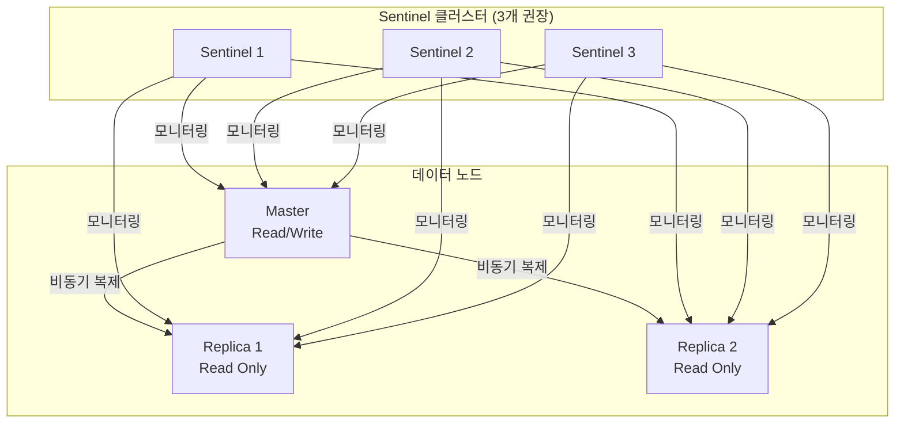
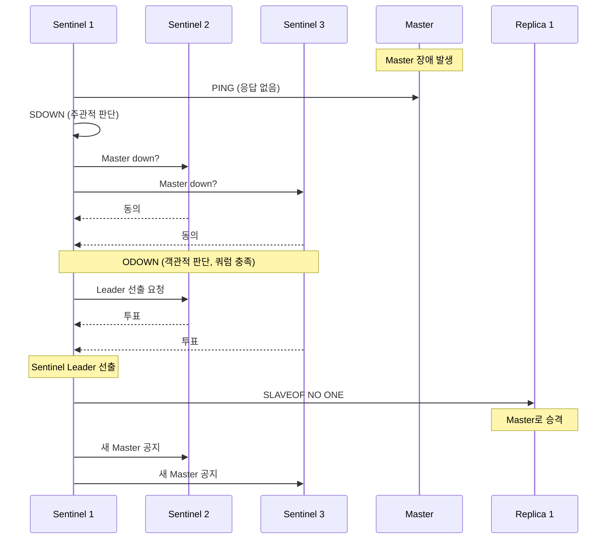
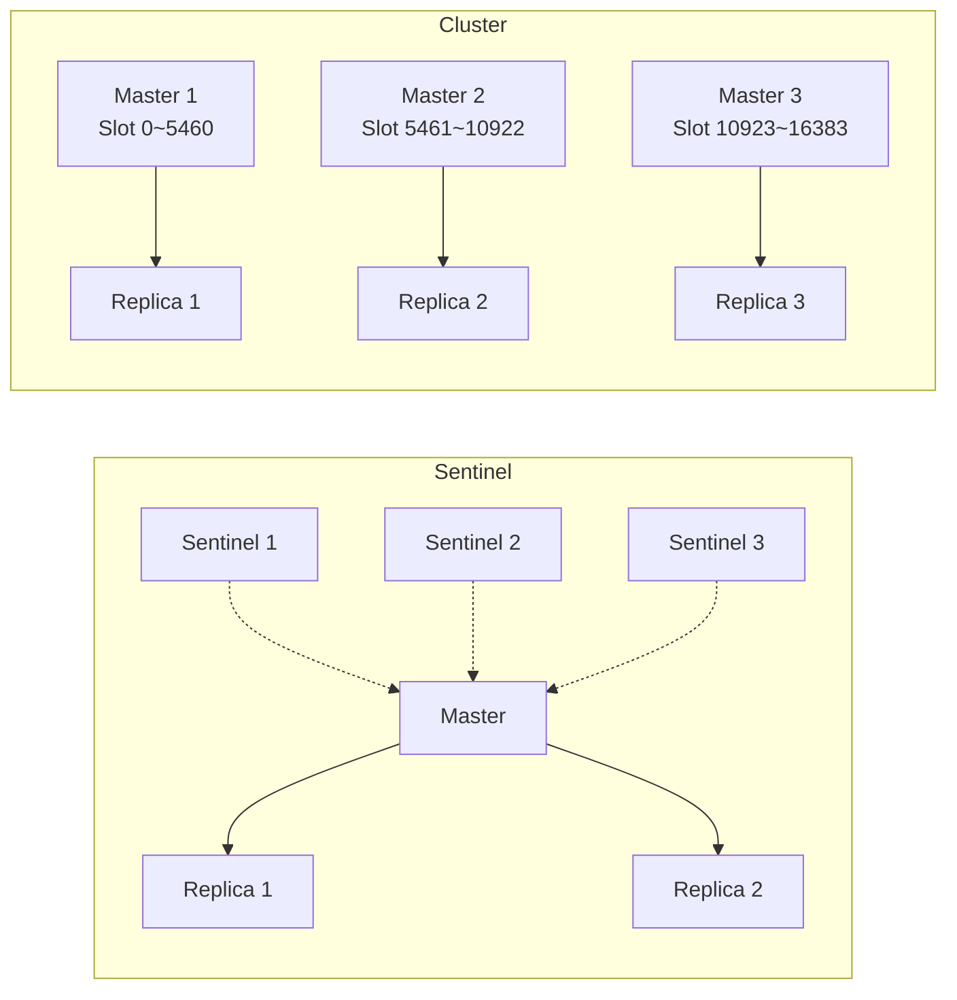
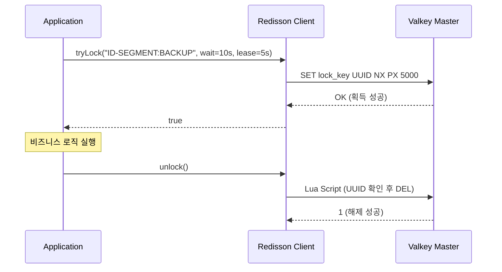
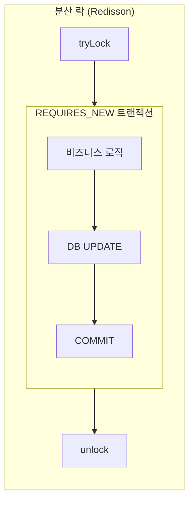
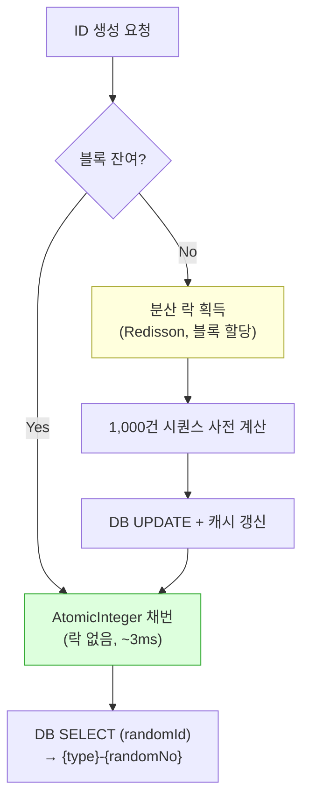
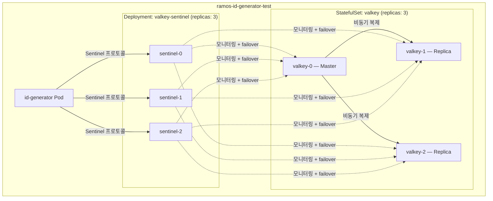

# Valkey Sentinel 운영 가이드

## 목적 (Goal)

Valkey Sentinel의 아키텍처, 운영 방법, Cluster와의 비교,
그리고 Redisson 라이브러리를 활용한 분산 락 구현 패턴을 종합 가이드로 제공한다.

---

## Valkey/Redis Sentinel이란?

Sentinel은 Valkey(Redis) 고가용성 솔루션으로, Master-Replica 구조에서
**자동 Failover**를 제공한다.



### Sentinel의 핵심 역할

| 역할 | 설명 |
|------|------|
| **모니터링** | Master/Replica 상태를 주기적으로 PING 확인 |
| **알림** | 장애 감지 시 관리자/클라이언트에 통지 |
| **자동 Failover** | Master 장애 시 Replica를 Master로 승격 |
| **서비스 디스커버리** | 클라이언트에게 현재 Master 주소 제공 |

### Failover 프로세스



### 주요 설정값

| 설정 | 설명 | 권장값 |
|------|------|--------|
| `down-after-milliseconds` | Master 무응답 판정까지 대기 시간 | 5,000ms |
| `failover-timeout` | Failover 최대 대기 시간 | 10,000~30,000ms |
| `parallel-syncs` | Failover 시 동시 재동기화 Replica 수 | 1 |
| `quorum` | ODOWN 합의에 필요한 최소 Sentinel 수 | 과반 (3개 중 2) |

---

## Sentinel vs Cluster 비교

### 아키텍처 비교



### 상세 비교

| 기준 | Sentinel | Cluster |
|------|----------|---------|
| **데이터 분산** | 단일 Master (모든 데이터) | 16,384 슬롯으로 샤딩 |
| **쓰기 확장** | 불가 (단일 Master) | 가능 (Master 수만큼) |
| **읽기 확장** | Replica로 읽기 분산 가능 | Replica로 읽기 분산 가능 |
| **Failover** | Sentinel이 자동 처리 | 클러스터 노드 간 자동 처리 |
| **최소 노드 수** | 3 (Sentinel) + 1M + 2R = 6 | 3M + 3R = 6 |
| **운영 복잡도** | 낮음 | 높음 (슬롯 관리, 리밸런싱) |
| **메모리 한계** | 단일 노드 메모리 | 노드 수 × 메모리 |
| **멀티 키 연산** | 제한 없음 | 동일 슬롯 내에서만 가능 |
| **분산 락** | 단일 Master에서 처리 | 키가 속한 Master에서 처리 |
| **클라이언트 복잡도** | 낮음 (Sentinel 프로토콜) | 높음 (MOVED/ASK 리다이렉트) |

### 언제 Sentinel을 선택하나?

| 상황 | 추천 |
|------|------|
| 데이터 크기가 단일 노드 메모리 이내 | **Sentinel** |
| 쓰기 TPS가 단일 Master로 충분 | **Sentinel** |
| 운영 인력/복잡도를 최소화하고 싶을 때 | **Sentinel** |
| 멀티 키 트랜잭션/Lua 스크립트 필요 | **Sentinel** |
| 분산 락만 사용 (데이터 캐시 부수적) | **Sentinel** |

### 언제 Cluster를 선택하나?

| 상황 | 추천 |
|------|------|
| 데이터가 수십 GB 이상으로 단일 노드 초과 | **Cluster** |
| 쓰기 TPS가 매우 높아 수평 확장 필요 | **Cluster** |
| 지리적 분산 배포가 필요 | **Cluster** |
| 키 샤딩으로 부하 분산이 핵심일 때 | **Cluster** |

### 본 프로젝트에서 Sentinel을 선택한 이유

1. **분산 락 전용** — ID 채번 시 시퀀스 동시성 제어가 주 용도
2. **데이터 크기 소량** — 타입별 시퀀스 캐시 (수 KB)
3. **멀티 키 불필요** — 타입 단위 단일 키 연산
4. **운영 단순성** — Alpha 환경 테스트 목적으로 최소 구성

---

## Redisson을 활용한 분산 락

### Redisson이란?

Redisson은 Redis/Valkey 기반의 Java 분산 자료구조 라이브러리로,
분산 락, 세마포어, 큐 등을 제공한다.

### 분산 락 동작 원리



### 핵심 파라미터

| 파라미터 | 설명 | 본 프로젝트 설정 |
|----------|------|-----------------|
| `waitTime` | 락 획득 대기 시간. 초과 시 `false` 반환 | 10초 (블록 할당) |
| `leaseTime` | 락 자동 해제 시간. 비정상 종료 시 데드락 방지 | 5초 (블록 할당) |
| `lockName` | 락 키. 동일 키를 가진 요청은 직렬화됨 | `ID-SEGMENT:{type}` |

### leaseTime vs Watchdog

| 방식 | 동작 | 장점 | 단점 |
|------|------|------|------|
| **고정 leaseTime** | 지정 시간 후 자동 해제 | 데드락 완전 방지 | 처리가 길면 조기 해제 |
| **Watchdog** (leaseTime=-1) | Redisson이 주기적으로 TTL 연장 | 처리 시간 무관 | Valkey 다운 시 연장 불가 |

본 프로젝트는 **고정 leaseTime=5초**를 사용한다.
블록 할당 로직이 5초 이내에 완료되므로 조기 해제 위험이 없고,
비정상 종료 시 5초 후 데드락이 자동 해소된다.

### 락과 트랜잭션 분리



`TransactionExecutor`가 `Propagation.REQUIRES_NEW`로 새 트랜잭션을 실행한다.
이를 통해 **트랜잭션 커밋 후 락 해제** 순서를 보장한다.

- 락 → 트랜잭션 시작 → 비즈니스 로직 → 커밋 → 락 해제
- 커밋 전에 락이 해제되면 다른 스레드가 커밋 전 데이터를 읽을 수 있음 (방지)

### Sentinel 환경에서의 Redisson 설정

```kotlin
config.useSentinelServers()
    .setMasterName("mymaster")
    .setCheckSentinelsList(false)       // K8s DNS 환경
    .setRetryAttempts(5)                // Failover 중 재시도
    .setRetryInterval(2000)             // 재시도 간격
    .setConnectTimeout(5000)            // 빠른 실패 감지
    .setTimeout(3000)                   // 명령 응답 타임아웃
    .addSentinelAddress("redis://sentinel-1:26379", ...)
    .setPassword("testpass")
```

**`setCheckSentinelsList(false)`**: K8s Headless Service 환경에서 Sentinel이
내부 Pod IP로 서로를 보고하기 때문에 비활성화.

---

## 본 프로젝트의 분산 락 아키텍처

### Segment 블록 할당 방식

기존 "매 요청마다 락"에서 "1,000건당 1회 락"으로 개선.



### Valkey 장애 시 방어 구조

```mermaid
flowchart TD
    Failure[Valkey 장애] --> Seg{블록 잔여?}
    Seg -->|Yes 99.9%| OK["정상 채번<br/>Valkey 무관"]
    Seg -->|No 0.1%| Retry["블록 할당 retry<br/>(최대 2회, 1초 간격)"]
    Retry -->|성공| OK
    Retry -->|실패| Err["503 Service Unavailable"]

    Failure --> Cache{캐시 조회}
    Cache -->|실패| DB["DB fallback"]
    Cache -->|성공| Hit["캐시 히트"]

    Failure --> CacheW{캐시 저장}
    CacheW -->|실패| Ignore["무시 (warn 로그)"]
    CacheW -->|성공| Written["캐시 갱신"]

    style OK fill:#dfd,stroke:#3a3
    style Err fill:#fdd,stroke:#a33
    style DB fill:#ddf,stroke:#33a
    style Ignore fill:#ffd,stroke:#aa3
```



### 성능 결과

| 지표 | Segment 적용 전 | Segment 적용 후 |
|------|----------------|----------------|
| 실패율 (50 VUs) | 91.33% | **0.00%** |
| p(95) | 5,000ms | **7.22ms** |
| 처리량 | 8.89 req/s | **238.23 req/s** |
| Failover 중 실패 (50 VUs) | - | **0.02%** (21/82,481) |

---

## K8s 환경 Valkey Sentinel 운영

### 본 프로젝트 구성 — 단일 StatefulSet (Helm Chart)

dev cluster에서 Master/Replica를 별도 StatefulSet으로 분리 배포한 초기 구성을 테스트한 결과,
**역할 역전(Failover 후 K8s Service 라우팅 불일치)** 이슈가 확인되었다.
이를 해결하기 위해 **단일 StatefulSet + Sentinel Deployment** 구조로 전환하였다.

> Helm Chart: `infrastructure/valkey-sentinel-chart/`
> 사내 표준 Chart: [valkey-sentinel-chart](https://github.nhnent.com/inje/valkey-sentinel-chart)



| 컴포넌트 | K8s 리소스 | Replicas | 비고 |
|----------|-----------|----------|------|
| Data Node | StatefulSet + PVC | 3 | Sentinel이 역할 관리 (Master/Replica 자동) |
| Sentinel | Deployment | 3 | initContainer로 config를 emptyDir에 복사 |
| Data PDB | PodDisruptionBudget | - | minAvailable: 2 |
| Sentinel PDB | PodDisruptionBudget | - | minAvailable: 2 (quorum 보장) |

### 배포/관리

```bash
# 배포
helm install valkey ./infrastructure/valkey-sentinel-chart \
  -n ramos-id-generator-test \
  -f infrastructure/valkey-sentinel-chart/values-dev.yaml \
  --set auth.password=<password>

# 업그레이드
helm upgrade valkey ./infrastructure/valkey-sentinel-chart \
  -n ramos-id-generator-test \
  -f infrastructure/valkey-sentinel-chart/values-dev.yaml \
  --set auth.password=<password>

# 삭제
helm uninstall valkey -n ramos-id-generator-test
kubectl delete pvc -l app.kubernetes.io/name=valkey -n ramos-id-generator-test
```

### K8s 특수 고려사항

| 항목 | 설명 |
|------|------|
| **단일 StatefulSet** | Master/Replica를 분리하지 않음. Sentinel이 역할 관리하므로 Failover 후 Service 불일치 원천 차단 |
| **DNS 해석** | `sentinel resolve-hostnames yes` 필수 (K8s Service 이름 사용) |
| **Config rewrite** | Sentinel은 config를 런타임에 수정하므로 initContainer로 ConfigMap → emptyDir 복사 |
| **Headless Service** | Data Node + Sentinel 모두 `clusterIP: None`으로 개별 Pod DNS 사용 |
| **PDB** | Sentinel minAvailable: 2 (quorum 보장), Data minAvailable: 2 |
| **AntiAffinity** | Sentinel: `required` (노드 분산 필수), Data: `preferred` |
| **maxmemory** | 192mb (컨테이너 limits 256Mi의 75%). OOM Kill 방어 |
| **이미지 태그** | `valkey/valkey:7.2.8` 고정 (재현성 확보) |

### Failover 시 주의사항

| 상황 | 대응 |
|------|------|
| Master Pod 재시작 | StatefulSet이 동일 PVC로 재생성 → 데이터 보존 |
| Failover 후 역할 변경 | Sentinel이 구 Master를 Replica로 재구성 → 수동 개입 불필요 |
| Sentinel 쿼럼 상실 | Deployment가 Pod 복구 → 자동 쿼럼 회복 |
| 네트워크 파티션 | Sentinel 쿼럼이 있는 쪽이 Failover 주도 |
| Stale Sentinel 엔트리 | `SENTINEL RESET mymaster`로 정리 |

---

## 운영 명령어

```bash
NS=ramos-id-generator-test

# ── 토폴로지 확인 ──
# Master 주소 조회
kubectl exec deploy/valkey-sentinel -n $NS -- \
  valkey-cli -p 26379 SENTINEL get-master-addr-by-name mymaster

# Replica 목록
kubectl exec deploy/valkey-sentinel -n $NS -- \
  valkey-cli -p 26379 SENTINEL replicas mymaster

# Sentinel 목록 (stale 엔트리 확인)
kubectl exec deploy/valkey-sentinel -n $NS -- \
  valkey-cli -p 26379 SENTINEL sentinels mymaster

# ── 상태 점검 ──
# Replication 상태
kubectl exec valkey-0 -n $NS -- \
  sh -c 'valkey-cli -a $VALKEY_PASSWORD INFO replication'

# 메모리 사용량
kubectl exec valkey-0 -n $NS -- \
  sh -c 'valkey-cli -a $VALKEY_PASSWORD INFO memory'

# 연결된 클라이언트 수
kubectl exec valkey-0 -n $NS -- \
  sh -c 'valkey-cli -a $VALKEY_PASSWORD INFO clients'

# 슬로우 쿼리
kubectl exec valkey-0 -n $NS -- \
  sh -c 'valkey-cli -a $VALKEY_PASSWORD SLOWLOG GET 10'

# ── 계획된 점검 ──
# 수동 Failover (graceful)
kubectl exec deploy/valkey-sentinel -n $NS -- \
  valkey-cli -p 26379 SENTINEL FAILOVER mymaster

# Stale 엔트리 정리
kubectl exec deploy/valkey-sentinel -n $NS -- \
  valkey-cli -p 26379 SENTINEL RESET mymaster
```

---

## 참고 자료

- [Valkey Sentinel 공식 문서](https://valkey.io/topics/sentinel/)
- [Redis Sentinel 공식 문서](https://redis.io/docs/management/sentinel/)
- [Redisson GitHub](https://github.com/redisson/redisson)
- [Redisson Sentinel Config](https://github.com/redisson/redisson/wiki/2.-Configuration#sentinel-mode)
- [사내 표준 Valkey Sentinel Chart](https://github.nhnent.com/inje/valkey-sentinel-chart)
- 프로젝트 Helm Chart: `infrastructure/valkey-sentinel-chart/`
- 프로젝트 테스트 리포트: `docs/load-test-report/`
- 분산 락 Failover 분석: `docs/analysis/distributed-lock-failover-analysis.md`
