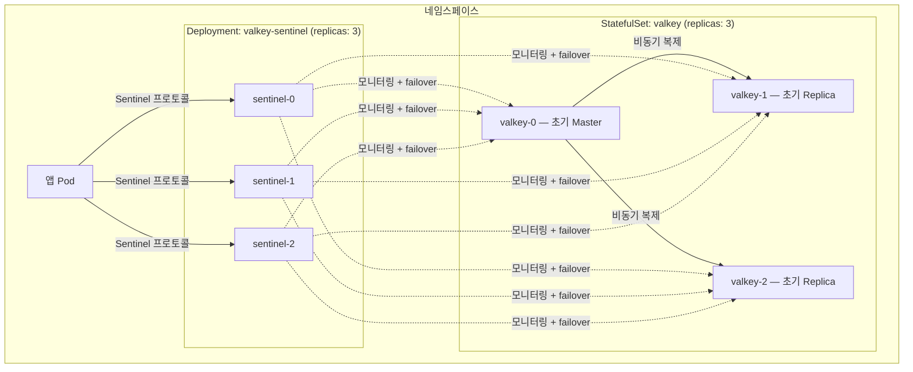
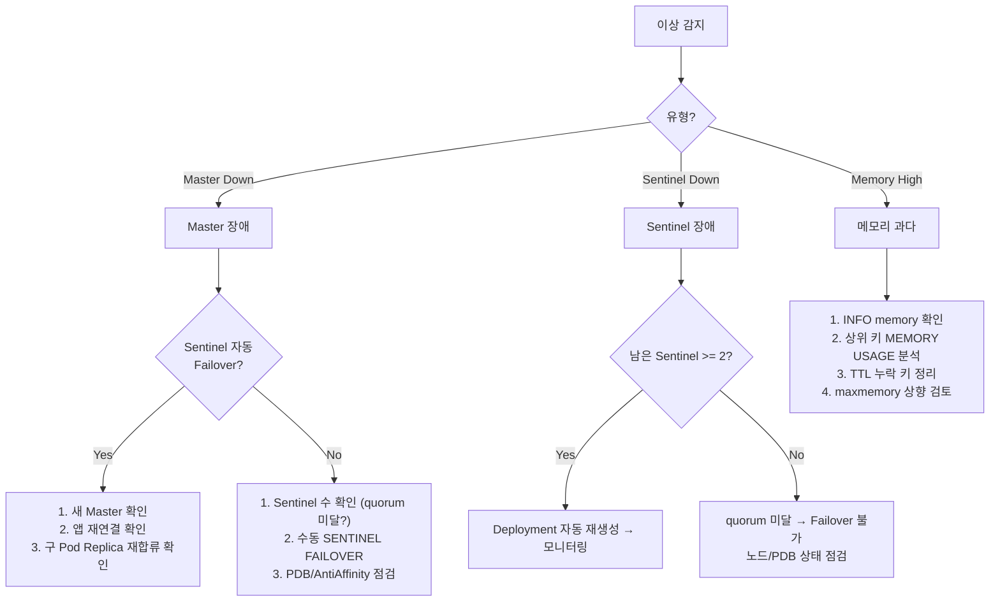

# Valkey Sentinel Helm Chart — 사내 표준 가이드

## 목적 (Goal)

K8s 환경에서 Valkey Sentinel HA 구성을 **단일 StatefulSet 패턴**으로 표준화한다.
dev cluster 테스트에서 발견된 분리형 StatefulSet의 구조적 한계(역할 역전, stale 엔트리)를 해결하고,
PDB/AntiAffinity/maxmemory 등 운영 안정성 항목을 기본 내장한다.

---

## 아키텍처

### 단일 StatefulSet 채택 근거

dev cluster(`nks_ccp-dev`)에서 Master/Replica를 별도 StatefulSet으로 분리 배포한 구성을 테스트한 결과,
**3가지 구조적 이슈**가 확인되었다.

| 이슈 | 설명 |
|------|------|
| **역할 역전** | Failover 후 K8s Service가 실제 Replica를 Master로 가리킴 |
| **Stale Sentinel** | Pod 재생성 시 이전 IP의 Sentinel이 `s_down`으로 잔존 |
| **Stale Replica** | 동일 노드가 DNS + IP로 중복 등록 |

**근본 원인**: Sentinel failover는 Valkey 역할만 변경하고, K8s label/Service는 업데이트하지 않는다.

**해결**: 단일 StatefulSet + Sentinel Deployment + Headless Service만 사용.
클라이언트(Redisson/Lettuce)가 항상 Sentinel을 경유하므로 Service 라우팅 문제가 원천 차단된다.

### 토폴로지



### 기존 분리형 대비 변경점

| 항목 | 분리형 (AS-IS) | 단일형 (TO-BE) |
|------|---------------|---------------|
| StatefulSet | master(1) + replica(2) = 2개 | **data(3) = 1개** |
| Service | master + replica + sentinel = 3개 | **headless + sentinel = 2개** |
| ConfigMap | master.conf + replica.conf + sentinel.conf | **valkey.conf + sentinel.conf** |
| Failover 후 Service | label 불일치 | **문제 없음** (Sentinel 경유) |
| YAML 파일 수 | 8개 | **7개 (Helm 템플릿)** |
| PDB | 없음 | **Data + Sentinel PDB 기본 포함** |
| AntiAffinity | 없음 | **Data(preferred) + Sentinel(required)** |
| maxmemory | 미설정 | **기본 192mb (limits 75%)** |
| 이미지 태그 | `valkey/valkey:7` | **`valkey/valkey:7.2.8` (고정)** |
| Probe 비밀번호 | `-a testpass` 하드코딩 | **Secret 환경변수 참조** |

---

## 빠른 시작

### 배포

```bash
# dev cluster
helm install valkey ./valkey-sentinel-chart \
  -n ramos-id-generator-test \
  -f valkey-sentinel-chart/values-dev.yaml \
  --set auth.password=testpass
```

### 상태 확인

```bash
NS=ramos-id-generator-test

# Pod 상태
kubectl get pods -n $NS -l app.kubernetes.io/part-of=valkey-sentinel

# Sentinel에서 Master 확인
kubectl exec deploy/valkey-sentinel -n $NS -- \
  valkey-cli -p 26379 SENTINEL get-master-addr-by-name mymaster

# Master INFO replication
kubectl exec valkey-0 -n $NS -- \
  sh -c 'valkey-cli -a $VALKEY_PASSWORD INFO replication'
```

### 삭제

```bash
helm uninstall valkey -n ramos-id-generator-test
# PVC는 수동 삭제 필요 (데이터 보존)
kubectl delete pvc -l app.kubernetes.io/name=valkey -n ramos-id-generator-test
```

---

## Chart 구조

```
valkey-sentinel-chart/
├── Chart.yaml                     # 차트 메타데이터
├── values.yaml                    # 사내 표준 기본값
├── values-dev.yaml                # dev cluster 오버라이드
├── README.md                      # 이 문서
└── templates/
    ├── _helpers.tpl               # 공통 헬퍼 (fullname, labels, FQDN)
    ├── configmap.yaml             # valkey.conf + sentinel.conf + init-replica.sh
    ├── secret.yaml                # VALKEY_PASSWORD
    ├── statefulset.yaml           # 단일 StatefulSet (Data Nodes)
    ├── sentinel-deployment.yaml   # Sentinel Deployment
    ├── services.yaml              # Headless(Data) + Headless(Sentinel)
    ├── pdb.yaml                   # Data PDB + Sentinel PDB
    └── servicemonitor.yaml        # Prometheus ServiceMonitor (선택)
```

---

## values.yaml 파라미터

### 필수 설정

| 파라미터 | 설명 | 기본값 |
|----------|------|--------|
| `auth.password` | Valkey 비밀번호 | `""` (배포 시 `--set` 필수) |
| `data.persistence.storageClass` | PVC StorageClass | `"devcc-board"` |

### 주요 설정

| 파라미터 | 설명 | 기본값 |
|----------|------|--------|
| `nameOverride` | 리소스 이름 접두사 | `"valkey"` |
| `global.image.tag` | Valkey 이미지 태그 | `"7.2.8"` |
| `data.replicas` | Data Node 수 (Master 1 + Replica N-1) | `3` |
| `data.config.maxmemory` | 메모리 상한 | `"192mb"` |
| `data.config.maxmemory-policy` | Eviction 정책 | `"allkeys-lru"` |
| `data.persistence.size` | PVC 크기 | `"2Gi"` |
| `sentinel.masterName` | Sentinel master 이름 | `"mymaster"` |
| `sentinel.config.downAfterMilliseconds` | SDOWN 판정 시간 | `5000` |
| `sentinel.config.failoverTimeout` | Failover 최대 시간 | `10000` |
| `sentinel.config.quorum` | Failover 합의 수 | `2` |
| `metrics.enabled` | Prometheus Exporter sidecar | `false` |

### maxmemory 산정 가이드

| 용도 | 공식 | 예시 |
|------|------|------|
| 캐시 전용 | limits.memory x 0.75 | 256Mi → 192mb |
| 캐시 + 분산 락 | limits.memory x 0.70 | 256Mi → 179mb |
| Streams + 캐시 + 락 | limits.memory x 0.65 | 512Mi → 332mb |

### Sentinel 파라미터 튜닝 가이드

| 파라미터 | 낮은 값 | 높은 값 | 판단 기준 |
|----------|---------|---------|-----------|
| `downAfterMilliseconds` | 3000 (민감) | 15000 (관대) | 네트워크 안정성. 불안정하면 높게 |
| `failoverTimeout` | 5000 (빠른 복구) | 30000 (안전) | 데이터 크기. 클수록 높게 |
| `quorum` | 2 (sentinel 3개) | 3 (sentinel 5개) | Sentinel 수의 과반수 |

---

## 프로젝트별 적용

### 새 프로젝트에 적용하기

```bash
# 1. values 오버라이드 파일 작성
cat > values-myproject.yaml << 'EOF'
data:
  persistence:
    storageClass: "my-storage-class"
    size: 4Gi
  config:
    maxmemory: "384mb"

sentinel:
  config:
    downAfterMilliseconds: 10000
    failoverTimeout: 30000
EOF

# 2. 배포
helm install valkey ./valkey-sentinel-chart \
  -n my-namespace \
  -f valkey-sentinel-chart/values-myproject.yaml \
  --set auth.password=$MY_PASSWORD
```

### 앱 연동 설정

#### Spring Boot + Redisson (Sentinel 모드)

```yaml
# application-valkey-alpha.yml
spring:
  data:
    redis:
      sentinel:
        master: mymaster
        nodes: valkey-sentinel.<namespace>.svc.cluster.local:26379
      password: ${VALKEY_PASSWORD}
```

#### Redisson 설정 포인트

```kotlin
config.useSentinelServers()
    .setMasterName("mymaster")
    .addSentinelAddress("redis://valkey-sentinel.<ns>.svc.cluster.local:26379")
    .setPassword(password)
    .setCheckSentinelsList(false)  // K8s Headless Service 환경 필수
    .setRetryAttempts(5)
    .setRetryInterval(2000)
    .setConnectTimeout(5000)
```

> `setCheckSentinelsList(false)` 는 K8s 환경에서 필수다.
> Sentinel이 내부 Pod IP로 서로를 보고하는데, 클라이언트가 이를 DNS로 해석하지 못하기 때문이다.

---

## 운영 가이드

### 일상 명령어

```bash
NS=<namespace>

# ── 토폴로지 확인 ──
# Master 주소 조회
kubectl exec deploy/valkey-sentinel -n $NS -- \
  valkey-cli -p 26379 SENTINEL get-master-addr-by-name mymaster

# Replica 목록
kubectl exec deploy/valkey-sentinel -n $NS -- \
  valkey-cli -p 26379 SENTINEL replicas mymaster

# Sentinel 목록
kubectl exec deploy/valkey-sentinel -n $NS -- \
  valkey-cli -p 26379 SENTINEL sentinels mymaster

# ── 상태 점검 ──
# Master 복제 상태
kubectl exec valkey-0 -n $NS -- \
  sh -c 'valkey-cli -a $VALKEY_PASSWORD INFO replication'

# 메모리 사용량
kubectl exec valkey-0 -n $NS -- \
  sh -c 'valkey-cli -a $VALKEY_PASSWORD INFO memory'

# 슬로우 쿼리
kubectl exec valkey-0 -n $NS -- \
  sh -c 'valkey-cli -a $VALKEY_PASSWORD SLOWLOG GET 10'

# ── 계획된 점검 ──
# 수동 Failover (graceful — 복제 완료 후 전환)
kubectl exec deploy/valkey-sentinel -n $NS -- \
  valkey-cli -p 26379 SENTINEL FAILOVER mymaster

# Stale 엔트리 정리
kubectl exec deploy/valkey-sentinel -n $NS -- \
  valkey-cli -p 26379 SENTINEL RESET mymaster
```

### 장애 대응 플로우



### 기존 분리형에서 마이그레이션

> 기존 `infrastructure/valkey/` 수동 매니페스트에서 Helm Chart로 전환할 때.

```bash
# 1. 기존 리소스 정리
kubectl delete statefulset valkey-master valkey-replica -n $NS
kubectl delete deployment valkey-sentinel -n $NS
kubectl delete service valkey-master valkey-replica valkey-sentinel -n $NS
kubectl delete configmap valkey-config -n $NS
kubectl delete secret valkey-secret -n $NS

# 2. 기존 PVC 삭제 (데이터 초기화)
kubectl delete pvc -l app.kubernetes.io/part-of=valkey-sentinel -n $NS

# 3. Helm Chart 배포
helm install valkey ./valkey-sentinel-chart \
  -n $NS \
  -f valkey-sentinel-chart/values-dev.yaml \
  --set auth.password=testpass

# 4. 상태 확인
kubectl get pods -n $NS -l app.kubernetes.io/part-of=valkey-sentinel
kubectl exec deploy/valkey-sentinel -n $NS -- \
  valkey-cli -p 26379 SENTINEL get-master-addr-by-name mymaster
```

---

## 설계 결정 기록

| 결정 | 근거 |
|------|------|
| 단일 StatefulSet | dev cluster 역할 역전 이슈(분석 리포트) → Service 불일치 원천 차단 |
| Sentinel을 Deployment | Stateless. config rewrite 대응은 initContainer + emptyDir |
| `postStart` lifecycle로 Replica 설정 | initContainer 대비 타이밍 유연, Master 준비 대기 가능 |
| ConfigMap에서 PLACEHOLDER → sed 치환 | Helm `{{ }}` + Valkey config 충돌 방지, Secret 값 런타임 주입 |
| Data AntiAffinity: preferred | 노드 수 부족 시 스케줄링 실패 방지 (Sentinel은 required) |
| PDB minAvailable: 2 | Data 3개 중 2개, Sentinel 3개 중 2개 → quorum + 읽기 가용성 보장 |
| maxmemory 기본 192mb | limits 256Mi의 75%. OOM Kill 방어 |
| down-after 5s (dev) | 빠른 Failover 테스트용. 프로덕션에서는 10~15s 권장 |

---

## 참고 자료

- [Valkey Sentinel 공식 문서](https://valkey.io/topics/sentinel/)
- [Helm Chart 개발 가이드](https://helm.sh/docs/chart_template_guide/)
- `docs/plans/valkey-sentinel-k8s-standard-plan.md` — 사내 표준화 종합 플랜
- `docs/plans/k6-standard-plan.md` — k6 부하테스트 사내 표준화 플랜
- `docs/valkey-sentinel-guide.md` — Valkey Sentinel 운영 가이드
- `docs/analysis/distributed-lock-failover-analysis.md` — 분산 락 Failover 분석
